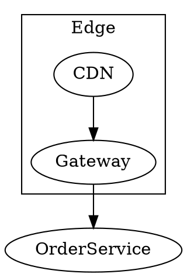
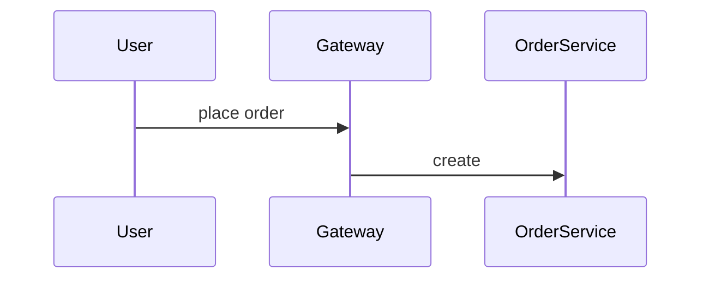

# mdx-artifact — document artifacts a person actually wants to read

Markdown from an agent is cheap in tokens and bare on the page. This skill has you write **MDX**
(markdown plus component tags) and hand it to
**[mdx-viewer](https://github.com/yanxuan-lc/mdx-viewer)**, a standalone global npm package that
renders it as a consistently themed, clearly structured, lightly interactive page.

## Core mental model

```
you write a.mdx        →   mdxv a.mdx   →   a person reads it in the browser (edits reload live)
markdown + <Components>    global CLI       theming · section nav · diagrams · math
```

**You deliver the `.mdx` and nothing else** — no CSS, no HTML scaffolding, no coordinates. The
presentation is composed by the components. The renderer does not live in this repo, so this skill
covers exactly two things: how to write the document, and how to put it in front of a person.

## Tool readiness, self-check, preview

The renderer is the global command `mdxv`, decoupled from any repo and runnable from anywhere:

```bash
command -v mdxv >/dev/null || npm install -g mdx-viewer   # first time only
mdxv --check path/to/doc.mdx   # (1) compile self-check — must pass before you deliver
mdxv path/to/doc.mdx           # (2) start the preview once it passes; hand over the URL
mdxv path/to/docs/             # rooted at a directory — opens README/index first, drawer on the left
mdxv demo                      # the bundled component tour, the fastest way to see what exists
```

> **Naming one file does not limit the preview to that file.** The root is always a *directory* —
> for `mdxv a/b/doc.mdx` that is `a/b/`, and every `.md`/`.mdx` beside it appears in the drawer.
> Read the `Documents: N` line in the banner; if N is larger than you meant to publish, the reader
> can see the rest. That matters when the document sits next to internal artifacts — notes,
> evidence, working files. **To expose exactly one document, copy it somewhere empty and serve
> that:**
>
> ```bash
> d=$(mktemp -d) && cp path/to/doc.mdx "$d"/ && mdxv "$d"
> ```

### Run `--check` before delivering

**A server that starts is not proof the document compiles.** Compilation is lazy — it happens when
the browser requests that particular document. So a broken document still makes `mdxv` print a
green `✓ Preview ready` and a URL, and that URL returns a 500. You hand over a dead link along with
the word "ready", and the failure surfaces only when the user clicks. `--check` exists to pull that
failure forward to a moment when you can still fix it.

Branch straight off the exit code:

| exit | meaning | what you do |
|---|---|---|
| `0` | everything compiled | start the preview, then accept it by actually loading it |
| `1` | at least one document failed | the report gives `file:line:column` and the reason; fix it, do not deliver |
| `2` | the check never ran | bad usage, missing path, empty directory — your command is wrong, not the document |

The report goes to stdout and `Error:` diagnostics to stderr, so `mdxv --check docs/ >report 2>err`
separates "the document is broken" from "you called it wrong". `--check` also accepts a directory
or `demo`, reporting per document and exiting `1` if any fails. Sweeping a whole tree costs well
under a second, so use it whenever you deliver a set.

If it reports `Unknown option: --check`, the installed `mdxv` is too old — `npm install -g
mdx-viewer@latest` and re-run.

### Passing `--check` is not the same as being right

It answers one question — does this compile. It says nothing about whether the preview loads or
whether the content is any good:

- **Loads but renders wrong** — a misspelled component (`<Callut>`), an illegal attribute value
  (`tone="purple"`), malformed math.
- **Does not load at all** — any top-level ESM statement or `{…}` expression that throws during
  module evaluation.

Those are examples, not a checklist. Once `--check` passes, still verify component names against
the cheat sheet below or against `mdxv demo`. Reading "the check passed" as "the content is fine"
is the specific mistake this paragraph exists to prevent.

- **The preview is a long-lived process.** Start it with Bash `run_in_background` and pull the
  `http://localhost:4321/?doc=…` it prints. Before delivering, load that URL for real — open it, or
  `curl --fail --silent --show-error '<URL>' >/dev/null` — and confirm it is not a 4xx/5xx.
- **Stop it with a command, not an intention.** A preview left running holds a port, and
  "remember to stop it later" is exactly the instruction that gets skipped when a session ends
  abruptly, which is when it matters. End the turn that started it by ending it:

  ```bash
  kill $(lsof -ti tcp:<the port in the URL it printed>) 2>/dev/null || true   # safe if already gone
  ```

  **Read that port off the URL rather than assuming 4321.** `mdxv` walks past an occupied port, so
  another preview — someone else's, or your own from an earlier turn — puts this one on 4322 or
  4323. Killing 4321 on that machine stops a process this turn never started and leaves the one it
  did start still holding its port. Measured: an unattended round would have done exactly that.

  Leave it running **only** when the user still needs the URL, and then say so, so the process is
  something they know about rather than something they discover.
- Common flags — `--port <n>` (**where it starts looking**, 4321 by default; it takes the next free
  port when that one is busy, so what it printed is the only place the real port is), `--host`,
  `--no-open`, `--lang zh-CN|en-US`.
- **When a global install is not permitted**, fall back to `npx -p mdx-viewer mdxv doc.mdx`.
- **Multi-document trees** — rooted at a directory, relative links in the body that point at local
  `.md`/`.mdx` files or directories are routed automatically, so plain markdown links wire up the
  whole tree. Directory links resolve by the `README.mdx` index convention; external links and
  anchors are left alone. Markdown is already valid MDX, so `.md` files preview directly.
- **Language variants** — sibling files sharing a stem plus a locale suffix (`guide.zh-CN.mdx` /
  `guide.en-US.mdx`) merge into one nav entry, selecting by interface language and falling back to
  the suffix-less version.

> The **authoritative source for components and parameters is mdx-viewer itself** — `mdxv --version`
> for the version, `mdxv --help` for what the installed one supports. This skill and
> `references/blocks.md` are a condensed cheat sheet; when they disagree with the package, the
> package wins, and fixing this skill is part of noticing.

## Document skeleton

**Header → lede → sectioned body → footer note → colophon.** A `title` in the frontmatter generates
the Hero header; the colophon is appended automatically at the very bottom.

```mdx
---
title: Order System Technical Design      # the Hero title (Hero appears only if this is set)
subtitle: Async decoupling over a message queue
author: Claude Opus 5                     # whichever model is writing — put your own name here
datetime: 2026-08-05 14:30:52             # the moment you write it, to the second (see below)
org: Platform Architecture                # joined into the Hero date line
copyright: Platform Architecture          # colophon line — © {year} {copyright}
palette: lime                             # indigo | teal | rose | amber | lime
mode: auto                                # light | dark | auto (togglable, top right)
toc: true                                 # floating right-hand TOC — wide viewports only, see below
footer: For feedback, contact Platform Architecture.
---

This design is written for the backend team…      <!-- lede, right after the auto Hero -->

<Section number="01" eyebrow="Background" title="Goals and constraints" />
…carry the key information in components — metrics in Stat, process in Steps,
comparison in Table or Columns, use cases in Scenario…
```

**Do not hand-write another `<Hero>`** — `title` already made one. To place your own, set
`hero: false` (or omit `title`) so you do not end up with two. Same for the colophon; it renders
automatically, so never hand-write `<Colophon>`.

**The `toc: true` floating TOC hides on viewports ≤1700px**, which means most laptop screens never
see it. Turn it on anyway — wide screens benefit — but do not promise the user "there's a table of
contents on the right". Readability has to be carried by the `<Section>` structure itself.

### The colophon, and why `datetime` is yours to write

A document should be able to say who wrote it and when. Each colophon field appears only if you
supply it:

- `author` + `datetime` → "Edited by {author} on {datetime}"; `copyright` → "© {year} {copyright}".
- **`datetime` has no fallback at all.** The renderer reads frontmatter and never captures the
  clock, so take the current time yourself and write it as `yyyy-MM-dd HH:mm:ss`. Omit it and the
  document carries no timestamp, leaving the reader unable to judge how fresh it is.
- A fixed line crediting mdx-viewer's repo, version and licence sits below the colophon. It ships
  with the renderer and frontmatter cannot configure it — ignore it.
- `chrome: off` removes the automatic header and footer, colophon included.

## Authoring conventions — this is where you trip

- **Use markdown wherever markdown works** — headings, lists, task lists `- [ ]`, tables (GFM is
  on), blockquotes, code fences, bold, italic, inline code, links. They get styled automatically,
  and code fences go through dual-theme highlighting that follows light/dark.
- **Never let a body line start with `<`.** This is the easiest trap here and the one with the least
  legible error. MDX parses a leading `<` as flow-level JSX, and that outranks inline code left
  unclosed across a line break. So hard-wrapping at ~100 columns blows up when the wrap point lands
  inside inline code containing `<…>`:

  ```mdx
  Layered config (offline: `--out <FILE>`). `--layer
  <global|tenant|workspace>` (defaults to `global`)
  ```

  That reports ``Unexpected character `|` (U+007C) in name`` — an error with no hint that line
  wrapping is involved, which makes it very hard to find. **Move the wrap point ahead of the inline
  code** so `` `--layer <global|tenant|workspace>` `` sits on one line. Fenced code blocks are
  unaffected; inside a fence, `<` and `import` are plain text.

  Self-check with `grep -nE '^<[^A-Z/]' doc.mdx` — components (`<Section`) and closing tags
  (`</Callout>`) start with a capital or `</`, so they are excluded, and the only hits are
  deliberate lowercase HTML blocks (fine) or this trap. Plain `grep '^<'` is useless here; it
  returns every component line, which is the same as no self-check at all.
- **Prose inside a block component needs blank lines around it** to render as a paragraph:

  ```mdx
  <Callout tone="warning" title="Risk">

  The payment callback has an **idempotency** problem.

  </Callout>
  ```

- **Array and object attributes use `{}`** — `<Hero stats={[{v:"3",l:"services"}]}>`.
- **Math** — `$E=mc^2$` and `$$…$$` work directly. When inline `{` or `_` risks being eaten as an
  expression, pass it as an attribute instead — `<Math tex="\frac{a}{b}" />`.
- **Code** — markdown fences are safest (`<` and `>` are literal). For a filename bar use
  `<Code filename="x.ts">`, and keep bare `<` or `{` out of its children by wrapping literals in a
  `` {`…`} `` template string.
- **Style only through semantic parameters** (`tone`, `ratio`, `status`) and never write colour
  values — that is what keeps a document re-themeable. `tone` takes
  `info | success | warning | danger`, and Card also takes `primary`.
- **Inline status** — drop `<Badge tone="success" dot>shipped</Badge>` straight into prose.
- **Escape hatch** — native HTML passes through where components do not reach, but prefer
  components; consistency is the thing you are buying.

### Block cheat sheet

`Hero` `Footer` `Section` `Callout` `Card` (badge/badgeTone) `Columns` `Toggle` `Steps`/`Step`
`Stats`/`Stat` `Fields`/`Field` `Scenario`/`When`/`And`/`Then` `Grid`/`Item`
(filterable/facets/tags) `Math` `Code` `Badge` `Figure`. Diagrams go in `dot`/`mermaid`/`svg`
fences — see below.

**Full attributes and examples in [`references/blocks.md`](references/blocks.md); a worked document
in [`references/example.mdx`](references/example.mdx). Read blocks.md before your first document —
guessing at attribute names is the most common way to produce something that compiles and renders
wrong. To see the components rendered, run `mdxv demo`.**

## Diagrams

A diagram is carried by a fenced code block, which is inherently safe for `<` and `{}`, and the
fence language routes it to one of three lanes. The selection rule is one sentence: **if Graphviz
can draw it, use Graphviz; use Mermaid for the sequence, state-machine and gantt work it cannot;
fall back to SVG when neither fits or when you need to place things by hand.**

| what you are drawing | fence | how it renders |
|---|---|---|
| flow, pipeline, dependency, call graph, class diagram, ER, architecture layers, tree | `dot` | build-time Graphviz (wasm) → static SVG |
| sequence diagram, state machine, gantt, user journey, git graph | `mermaid` | client-side, follows light/dark |
| custom shapes, exact placement, anything the other two cannot express | `svg` | inlined as-is |

- **Graphviz by default** — structure and relationship diagrams are the overwhelming majority, and
  `subgraph cluster` and `rank` let you make position mean something (layer boundaries, parallel
  branches).
- **Mermaid fills the gaps** where Graphviz has no notation for the thing.
- **SVG is the escape hatch** — hand-write one when the engines cannot express it or auto-layout is
  simply wrong. Colour with `currentColor` or CSS variables (`var(--accent)`) and it follows
  light/dark.
- **Captions** — wrap the diagram in `<Figure caption="…">`. Every diagram gets a fullscreen zoom
  button with no work from you.
- **The full decision table, recall vocabulary and tie-breakers** are in
  [`references/blocks.md`](references/blocks.md).

````mdx
<Section number="03" title="Deployment architecture" />



<Figure caption="Order placement, main path">



</Figure>
````

## Boundaries

- **The artifact is `.mdx`, not HTML.** Do not hand-write HTML scaffolding, CSS or coordinates, and
  do not build a separate page to "make it presentable" — MDX is the single source and `mdxv` is
  how you view it.
- **When a component seems missing, first ask whether existing blocks compose into it.** A genuinely
  new component belongs upstream in mdx-viewer, not reimplemented here.
- **Do not use this to dodge a real answer.** A beautiful document built on thin analysis is worse
  than plain text with a solid one, because the presentation buys credibility the content has not
  earned.
