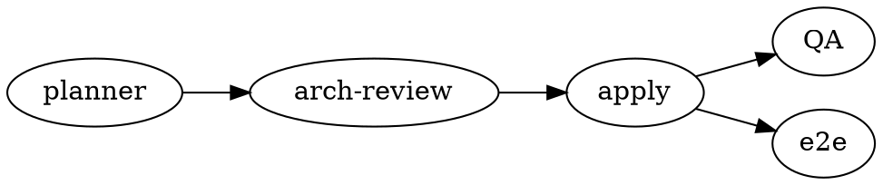
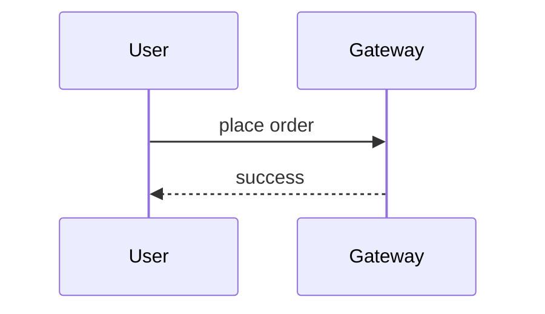

# mdx-artifact · Block API cheat sheet (MDX)

Component reference for writing `.mdx`, aligned with **mdx-viewer ≥ 0.2.0** (the renderer is the global CLI `mdxv`; the package itself is the authoritative source, and `mdxv demo` shows you exactly how each component renders).

**Principle: write prose / headings / lists / task lists / tables / code / quotes as plain Markdown; use component tags for rich blocks, layout, interaction, and math.** Style only through semantic enums, never colour values.

## General MDX conventions (read first)

- **Prose inside a block component needs blank lines around it** to render as a markdown paragraph (see the example below).
- **Array/object attributes use `{}`**: `stats={[{v:"3",l:"services"}]}`.
- **Math**: the official `$…$` / `$$…$$` works directly; when MDX expression syntax gets in the way, switch to the attribute form `<Math tex="\frac{a}{b}" />`.
- **Use markdown fences for code** (safe for `<>`, Shiki dual-theme highlighting); self-closing components end in `/>`.
- Native Markdown (styled automatically): `## / ### / ####`, `**bold**`/`*italic*`/`` `code` ``/`[link](url)`, `- / 1.`, task lists `- [ ]`, GFM tables, `>` quotes, `---`, code fences <code>```lang</code>.

---

## frontmatter

| field | values |
|---|---|
| `title` | document title (Hero is auto-generated only if this is set) |
| `subtitle` | header subtitle |
| `eyebrow` | eyebrow line of the auto Hero |
| `author` | the model that wrote this document (e.g. `Claude Opus 5`); goes into the colophon with `datetime` |
| `datetime` | edit time, `yyyy-MM-dd HH:mm:ss` · **you must fill it in**; the renderer never generates it |
| `org` | joined into the Hero date line (`datetime · org`) |
| `copyright` | colophon copyright line, `© {current year} {copyright}` |
| `footer` | optional · footer note (narrative band, shown above the colophon) |
| `palette` | `indigo`(default) \| `teal` \| `rose` \| `amber` \| `lime` |
| `mode` | `light` \| `dark` \| `auto` (togglable top right, and remembered) |
| `density` | `comfortable`(default) \| `compact` |
| `toc` | `true` for the floating right-hand TOC; **auto-hidden on viewports ≤1700px** (most laptops never see it — don't promise it) |
| `hero` | `false` disables the auto Hero (use it when the body writes its own `<Hero>`) |
| `chrome` | `off` disables the auto header and footer (colophon included) |

> The **colophon** sits at the very bottom of the page, and every field **shows only if provided**:
> 1. **Document info**: `Edited by {author} on {datetime}  ·  © {current year} {copyright}`. **`datetime` has no fallback** — omit it and there is no timestamp, leaving the reader unable to judge freshness.
> 2. **Renderer credit**: mdx-viewer's repo · version · MIT (shipped with the renderer, not configurable from frontmatter).
>
> With `chrome: off` the entire colophon is suppressed.

## Hero
`eyebrow` `title` `sub` `date` (free text, usually the date/org) `stats={[{v,l}]}`; children = the description paragraph.
**When the frontmatter has `title`, a Hero has already been generated** — to write your own, also set `hero: false`, otherwise you get two.
```mdx
<Hero eyebrow="design · v1" title="Order System" sub="Async decoupling" date="2026-07-25 · Platform Architecture" stats={[{v:"1.2M",l:"orders/day"}]}>
One sentence stating what this document is.
</Hero>
```

## Footer (optional note band)
children = markdown. **Optional** — acknowledgements / contacts / version notes, shown **above** the colophon. Leave it out and the bottom of the page holds only the colophon (see the note under the frontmatter table). A single-line note can also come from the frontmatter `footer:`.
```mdx
<Footer>

For feedback contact **Platform Architecture**; see CHANGELOG for the update history.

</Footer>
```

## Section
`number` `eyebrow` `title` `anchor`. Self-closing, feeds the TOC.
```mdx
<Section number="02" eyebrow="Architecture" title="Services and data" />
```

## Callout
`tone`(info | success | warning | danger) `title`. **Separate the content with blank lines.**
```mdx
<Callout tone="warning" title="Risk">

The payment callback has an **idempotency** problem; it must be resolved before T1.

</Callout>
```

## Badge (inline)
`tone` `dot`(boolean). Write it inside prose.
```mdx
Current status <Badge tone="success" dot>shipped</Badge>.
```

## Card
`tone`(`primary` allowed) `title` `badge` `badgeTone` (the badge renders in the top-right corner).
```mdx
<Card tone="primary" title="Key metrics" badge="v1.0" badgeTone="success">

<Stat value="99.95%" label="availability" delta="+0.1" dir="up" />

</Card>
```

## Columns
`ratio`: `1:1` | `2:1` | `1:2` | `1:1:1`. Each direct child block = one column.
```mdx
<Columns ratio="2:1">
<Card title="left (wide)">…</Card>
<Card title="right (narrow)">…</Card>
</Columns>
```

## Toggle
`title` `open`(boolean). A collapsible block.
```mdx
<Toggle title="Expand: glossary">
<Fields><Field k="SLO" v="service level objective" /></Fields>
</Toggle>
```

## Steps / Step
`Step`: `title` `status`(done | active | omitted); children = the description.
```mdx
<Steps>
<Step title="Place order" status="done">Validate stock and price</Step>
<Step title="Pay" status="active">Call the payment gateway</Step>
<Step title="Ship">Create the fulfilment order</Step>
</Steps>
```

## Stats / Stat
`Stat`: `value` `label` `delta` `dir`(up | down). Wrap several in `<Stats>`.
```mdx
<Stats>
<Stat value="1.2M" label="orders/day" delta="+8%" dir="up" />
<Stat value="240ms" label="P99 latency" delta="-12%" dir="down" />
</Stats>
```

## Fields / Field
`Field`: `k` `v`.
```mdx
<Fields>
<Field k="runtime" v="Node 20 / TypeScript" />
<Field k="storage" v="MySQL 8 + Redis" />
</Fields>
```

## Scenario
`title`; child tags `<When>/<And>/<Then>` (repeatable).
```mdx
<Scenario title="Scenario: user submits an order">
<When>the user clicks "Submit" and stock is sufficient</When>
<And>the payment channel is available</And>
<Then>create the order and return status created</Then>
</Scenario>
```

## Grid / Item
`Grid`: `filterable`(boolean) `facets="id:label,id:label"`; `Item`: `tags` (space-separated).
```mdx
<Grid filterable facets="desc:descriptive,diag:diagnostic,pred:predictive">
<Item tags="desc">Trend analysis</Item>
<Item tags="desc diag">Funnel analysis</Item>
</Grid>
```

## Math
Prefer the official syntax: inline `$E=mc^2$`, display `$$…$$` (KaTeX). The component form `<Math tex="…" />` is for the cases where `{`/`_` gets eaten by MDX as an expression; `display="inline"` makes it inline.
```mdx
<Math tex="\text{QPS}_{\max} = \frac{N}{\bar{t}} \times \eta" />
```

## Code (with a filename)
`filename`; children = the code (**keep bare `<` / `{` out** — they are read as JSX/expressions; wrap literals in a `` {`…`} `` template string, and for code containing generics just switch to a markdown fence).
```mdx
<Code filename="config.json">{`{ "port": 8080 }`}</Code>
```
Ordinary code goes in a markdown fence (safe for `<>`, Shiki dual-theme highlighting): <code>```ts order.ts</code> … <code>```</code>

## Diagrams: three lanes + scenario routing

Diagrams are carried by a **fenced code block**, and the fence language picks the engine (inherently safe for `<`/`{}`; do not pass source through a `<Diagram>` component).

**The rule in one sentence**: if **Graphviz** can do it, use Graphviz; use **Mermaid** for the **sequence / state machine / gantt** work it can't; fall back to **SVG** when neither fits or when you need **exact manual placement**.

### Scenario → fence language (decision table)

| what you're drawing | language | rendering |
|---|---|---|
| flowchart / pipeline / approval flow / workflow | `dot` | build-time Graphviz(wasm) → static SVG |
| dependencies / call chain / module relations / DAG / directed graph | `dot` | same |
| class diagram (UML class) / inheritance, association | `dot` (`shape=record`) | same |
| ER diagram / data model / table relations | `dot` (`record` + crow's-foot) | same |
| system architecture / layered architecture / deployment topology / service boundaries | `dot` (`subgraph cluster` = boundary) | same |
| tree / hierarchy / org chart / directory tree / decision tree | `dot` | same |
| **sequence diagram / interaction sequence** (lifelines, alt/loop) | `mermaid` | client-side render · loaded on use |
| **state machine / statechart** (composite states, event transitions) | `mermaid` | same |
| gantt / schedule / timeline / user journey / git branch graph | `mermaid` | same |
| custom illustration / concept diagram / coordinates, geometry / annotated figure / composed shapes (**fallback**) | `svg` | inlined as-is |

### Recall vocabulary (think of these words, use that lane)

- **`dot` (Graphviz)**: flowchart, pipeline, approval flow, dependency graph, call chain, module relations, class diagram, ER diagram, data model, table relations, architecture diagram, system architecture, layered architecture, deployment diagram, topology, service boundaries, org chart, tree/hierarchy, DAG, directed graph
- **`mermaid`**: sequence diagram, sequence, interaction sequence, lifeline, state machine, statechart, state transitions (with events), gantt chart, gantt, schedule, timeline, user journey, journey, git branch graph
- **`svg`**: custom illustration, concept diagram, coordinate plot, geometric sketch, annotated figure, schematic, exact placement required, non-standard diagram, composed shapes

### Tie-breakers (the overlapping cases)

1. **Flowcharts**: mermaid can draw them too, but **`dot` is the default** — stable output plus `cluster`/`rank` for positional control. Reach for `mermaid` only when the notation turns interaction-flavoured (swimlanes, complex conditional fragments).
2. **State transitions vs state machines**: just "boxes and arrows" → `dot`; a formal statechart with composite/nested states and event-annotated transitions → `mermaid`.
3. **Data charts** (pie/bar/line): **out of scope for the diagram engines** (a future DataView owns them). A minimal pie chart can lean on mermaid `pie` for now, but a chart is not a relationship diagram — don't force it into dot/svg.

### Usage

- `dot`: the renderer **only adapts light/dark** — it swaps Graphviz's black strokes and text for `currentColor`
  and strips the white background plate.
  **It injects no shapes and no fills**: without a `node [...]` line you get Graphviz's default **unfilled ellipse**
  (`fill="none"`). So the division of labour is the reverse of what you'd guess — **write the shapes yourself, don't
  write the colours**: `node [shape=box style=rounded]` is on you, while leaving colour unset is what lets it
  follow light/dark. Hard-code `color=` / `fillcolor=` and it is pinned to that value, no longer adapting in dark mode.
- `mermaid`: theme variables come from the current palette, and it re-renders automatically with light/dark.
- `svg`: colour with `currentColor` or `var(--accent)`/`var(--ink)` and it adapts to light/dark automatically.
- **Captions**: wrap it in `<Figure caption="…">`; the caption is centred below the diagram.
- **Fullscreen view**: every diagram has a zoom button in its top-right corner (revealed on hover, always visible on touch); clicking it opens the fullscreen viewer — **scroll to zoom (cursor-anchored), drag to pan, a zoom-in/zoom-out/fit-to-window toolbar, Esc or a background click to close**. Zoom works on the SVG's intrinsic dimensions rather than a CSS transform, so it stays sharp at any scale. No author effort required; diagrams from all three engines get it automatically.

````mdx


<Figure caption="Order placement, main path">



</Figure>

```svg
<svg viewBox="0 0 120 40"><rect x="4" y="4" width="112" height="32" rx="6" fill="var(--surface-2)" stroke="var(--accent)"/><text x="60" y="25" text-anchor="middle" fill="var(--ink)">custom</text></svg>
```
````

---

## When the components aren't enough
First check whether existing Blocks compose into what you need. If a new component really is required, that belongs **upstream in mdx-viewer**: write a React component in its `src/app/components/blocks.tsx` and append `TagName: Component` to the mapping in `src/app/mdx-components.tsx` (the core render pipeline stays untouched). **Do not rebuild the renderer in this repo** — change upstream first, then come back and fix this cheat sheet.
