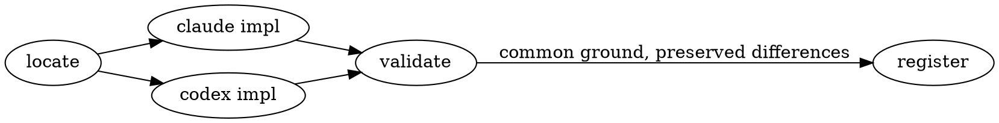

<Hero eyebrow="a Vibe Working relic, like Excalibur" title="ExcaliVibe ⚔️" sub="Excalibur + Vibe — a Vibe Working capability suite" date="2026-07-25 · runs on both Claude Code and Codex" stats={[{v:"2",l:"agents supported"},{v:"3",l:"capability plugins"},{v:"9",l:"dev subagents"}]}>
Born out of Vibe Coding, but not confined to coding: aimed at a wider set of business scenarios, installing capabilities through each agent's own marketplace + plugin mechanism.
</Hero>

The same capability solves the same problem and follows the same main flow on the Claude side and the Codex side; only the implementation differs, each landing on the primitives that suit it best — that is "seek common ground while preserving differences".

<Section number="01" eyebrow="Top principle" title="Seek common ground, preserve differences" />

<Callout tone="info" title="Seek common ground while preserving differences">

**Common ground**: architecture and main flow are identical on both sides. **Preserved differences**: each side implements in whatever way is best for it — never lower one side's capability to a compromise just to line the two up.

</Callout>

<Section number="02" eyebrow="Capability matrix" title="Three plugins" />

<Card tone="primary" title="genai-dev-flow" badge="3.1" badgeTone="success">

The generative-AI development workflow suite. Step definitions are data, the state a gate reads is measured off disk, and orchestration is delegated to the **fsx** engine rather than reimplemented. Paradigm = spec-driven plus test-driven, with the acceptance evidence produced by an agent that wrote neither the tests nor the code.

</Card>

<Card title="computer-use" badge="v3.0.0" badgeTone="success">

Shared infrastructure: browser automation (Chrome DevTools / Playwright MCP, with a graceful-browser decision layer on the Claude side) plus **mdx-artifact rich document artifacts** (this very page is written to its conventions).

</Card>

<Card title="dev-toolkit" badge="skills only" badgeTone="warning">

Nineteen atomic development skills — guidelines, research, scans, TDD and e2e execution. The odd one out of the three: no agents and no hooks, so it is the whole suite's answer to "what does a capability look like with nothing bundled around it".

</Card>

<Section number="03" eyebrow="Engineering" title="Project structure" />

<Fields>
<Field k="dual-end mirror" v="one copy each under claude/ and codex/, same main flow" />
<Field k="process convention" v="OpenSpec + opsx:* commands, built in" />
<Field k="manifest location" v="both marketplace manifests sit at the repo root, one-click install from GitHub" />
</Fields>

<Section number="04" eyebrow="Getting started" title="Installation" />

**Claude Code**:

```bash
claude plugin marketplace add yanxuan-lc/excalivibe
claude plugin install genai-dev-flow@excalivibe
```

**Codex** (CLI v0.117.0+):

```bash
codex plugin marketplace add yanxuan-lc/excalivibe
codex plugin add genai-dev-flow@excalivibe
```

<Section number="05" eyebrow="Metrics" title="Capacity model" />

Capacity is estimated from peak QPS; single-instance throughput follows:

<Math tex="\text{QPS}_{\max} = \frac{N_{\text{worker}}}{\bar{t}_{\text{req}}} \times \eta" />

| metric | target | current |
|---|---|---|
| availability | 99.95% | 99.97% |
| P99 latency | 240ms | 228ms |

<Section number="06" eyebrow="Process" title="Adding a capability" />

<Steps>
<Step title="Locate" status="done">Decide which plugin the capability belongs to and which primitive it uses</Step>
<Step title="Implement on both ends" status="active">Land it in claude/ and codex/ together, main flows aligned</Step>
<Step title="Register">Append it to the marketplace / plugin manifests on both sides</Step>
</Steps>

<Figure caption="Dual-end sync, main flow (rendered by Graphviz)">



</Figure>

<Section number="07" eyebrow="Appendix" title="Capability index" />

<Grid filterable facets="infra:infrastructure,dev:engineering,ops:operations">
<Item tags="dev">genai-dev-flow</Item>
<Item tags="infra">computer-use</Item>
<Item tags="ops">dev-toolkit</Item>
</Grid>

<Footer>

This page is written to computer-use's **mdx-artifact** conventions (eating our own dog food) and previewed with `mdxv` — the colophon below is appended by the renderer from the frontmatter.

</Footer>
