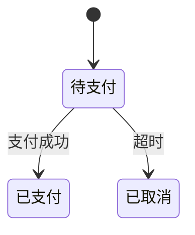
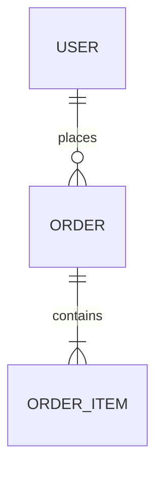
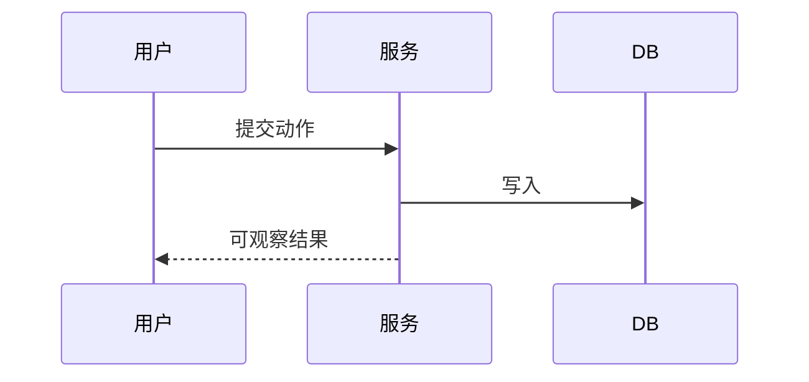

# REVIEW.mdx 模板与逐节写作指引（架构门人审文档）

本文件是 planner 生成 `openspec/changes/<id>/REVIEW.mdx` 的权威模板。REVIEW.mdx 是
**架构门（Architecture Gate）**的人审载体：在写代码之前，由人评估这次变更的**架构边界
是否合理、是否可扩展、是否守得住领域规则**——此刻改动只值一次 spec 编辑，而非重写。

骨架照抄，占位内容按指引填。成品参考 [worked-example.mdx](worked-example.mdx)。

---

## 三条硬要求（贯穿全文，不可违背）

### 1. 承载与内容形式
- **承载**：一份 **MDX**（Markdown 超集 + 组件）文件 `REVIEW.mdx`，由 **plugin-infra 的
  `mdx-artifact` skill** 渲染成主题化、可交互目录、自包含离线的富 HTML 供人审阅。正文**能用
  Markdown 就用 Markdown**；图 / 关键决策 / 元信息 / 分节用组件增强（见骨架）。
  **MDX 仍是唯一的源**，HTML 只是可随时重生的渲染产物——不手写 HTML、不在 MDX 之外另造页面。
- **内容形式优先级（高→低）**：**图（mermaid / graphviz）＞ 表格 ＞ DSL（如建表 DDL）＞ 文字描述**。
  每个要表达的点，先问「能不能用图说清」，不能再退表格，再退 DSL，文字是最后手段。
  - 模块依赖 / 架构分层 / 有向流程 → ` ```dot `（graphviz，构建期静态出图、零运行时）。
  - 类图 / ER / 状态机 / 时序 → ` ```mermaid `（`classDiagram` / `erDiagram` /
    `stateDiagram-v2` / `sequenceDiagram`）。
  - 并列属性、对照、清单 → 表格。
  - 精确的 schema / 契约 → DSL（` ```sql `、` ```jsonc `）。
  - 只有「关键决策的理由与权衡」这类无法图表化的，才用文字，且控制在一段内。

### 2. 自包含——不假设读者看过任何其他文档
本流程是 **AI 自驱（AI-driven）**的：用户**没有**读过 spec、proposal、BRIEF 或任何中间产物。
所以 REVIEW.mdx 必须**独立成篇**：
- 不要写「见 spec 第 X 节」「如 proposal 所述」就当读者已知——确需深究的，在「深究指针」里
  一句话说明那是什么、在哪。
- 出现的每个领域名词、缩写、外部系统名，**首次出现处用一句话讲清它是什么**。宁可啰嗦。

### 3. 术语首现双语
任何技术/领域术语**首次出现**时写成**「中文（English）」**，方便对照与检索。例：
「限界上下文（Bounded Context）」「聚合（Aggregate）」「幂等（Idempotency）」
「最终一致（Eventual Consistency）」。同一术语后续可只用中文。

### MDX 写法要点（避免踩坑）
- **`<…>` 占位必须全部替换成真实内容**：MDX 会把正文里的 `<xxx>` 当作组件解析——**残留任何未替换的
  尖括号占位都会导致渲染失败**。骨架里的 `<变更 ID>`/`<要达成的>`/`<决策标题>` 等都是「填我」标记。
  确需展示**字面尖括号**（如 `<T>` 泛型、`<tag>`）时，用**反引号包裹**（`` `<T>` ``）或改用「」/〈〉。
  （注：`<Field v="<x>">` 这类**在 JSX 属性引号内**的 `<>` 是字符串、安全；危险的只有正文散文里的。）
- **块组件内的散文/表格要用空行分隔**才被当 markdown 渲染：`<Callout>` 与其内容之间空一行。
- **图用围栏**：` ```dot ` / ` ```mermaid `（对 `<` `{}` 天然安全，别把图源塞进组件属性）。
- **元信息用 `<Fields>`**、**分层用 `<Section>`**、**关键决策/风险/提示用 `<Callout tone=…>`**。
- 样式只用语义参数（`tone`），不写颜色。

---

## 深度档（Depth Dial）——按变更缩放，别一律满档

REVIEW.mdx 的体量随变更的**关键度/新颖度**缩放，不是每次都写满：

| 档位 | 写什么 |
|------|--------|
| **novel-core（新颖核心）** | **满档**：①框定 + §0 领域模型 + §1–§4 四契约 + ③审议 + ④横切（含可测场景）|
| **supporting（支撑）** | 框定一两行 + 实际涉及的契约 + 关键决策 + 触发到的横切面 |
| **generic / 可逆** | 框定一行 + 仅动到的契约；§0 领域模型常可省（无新领域概念）；横切按需 |

缺席的契约/层在概览表显式标注「本变更不涉及」，**保留编号**、节内只写一行。

---

## 骨架（照此结构生成 REVIEW.mdx）

````mdx
---
title: 架构评审 — <change-id>
subtitle: Architecture Gate · 人审文档
author: <生成本文的模型，如 Claude Opus 4.8>
date: <YYYY-MM-DD>
palette: indigo
mode: auto
toc: true
---

<Callout tone="warning" title="只读派生物 · 请勿直接编辑">

本文档由 spec（机器可读的设计产物）**单向派生**，仅供人工审查。修改意见请反馈给 planner
回流至 spec 后**重新生成**——直接编辑会产生第二份事实源。

</Callout>

<Fields>
<Field k="变更 ID" v="<change-id>" />
<Field k="生成时间" v="<YYYY-MM-DD HH:mm，date 命令取>" />
<Field k="Spec 版本" v="<spec-hash.sh 输出，12 位十六进制>" />
<Field k="关键度 / 自治档位" v="core / supporting / generic ｜ <ceiling>" />
<Field k="Arch-review（AI 设计预审）" v="✅ 已闭环（N 项已消化进 spec）/ 跳过：<原因>" />
<Field k="状态" v="⏳ 待人工评审（架构门）" />
</Fields>

本文档分四层：① 框定（背景边界）→ ② 结构（领域模型 + 四契约）→ ③ 审议（关键决策的备选与权衡）→ ④ 横切（质量视角，每项给可测场景）。

| 层 / 契约 | 本变更是否涉及 | 章节 |
|---|---|---|
| ① 框定 | ✅ | 见下 |
| ②§0 领域模型 | ✅ / 无新领域概念 | §0 |
| ②§1 模块设计 | ✅ / 不涉及 | §1 |
| ②§2 接口设计 | ✅ / 不涉及 | §2 |
| ②§3 数据库设计 | ✅ / 不涉及 | §3 |
| ②§4 用例设计 | ✅ | §4 |
| ③ 关键决策 | ✅ N 条 | §5 |
| ④ 横切质量 | ✅ 触发 N 项 | §6 |

<Section number="01" eyebrow="框定" title="背景 · 目标 · 约束" />

**背景与范围**：<一两句，让没有前置知识的读者进入状态；产品名/系统名首现一句话解释。>

| ✅ 目标 | ❌ 非目标（本可做、显式排除）|
|---|---|
| <要达成的> | <刻意不做的——堵住范围蔓延>|

**约束（Constraints）**：<技术 / 资源 / 合规硬约束，后续取舍的前提。>

<Section number="02" eyebrow="结构" title="领域模型与四契约" />

### §0 领域模型（Domain Model）

<Callout tone="info" title="评审的参考框架">

模块 / 接口 / 库表 / 用例是否「合理」，都相对这里的领域模型而言。承接需求澄清阶段已框定的领域概念，不在此重新发明。

</Callout>

- **限界上下文（Bounded Context）**：<本变更属哪个上下文；边界在哪、为何不能渗过去。>（限界上下文 = 同一个词在不同业务范围里含义不同，故划定的语义边界。）
- **聚合与不变式（Aggregate & Invariant）**：表格列核心聚合及其**永远成立的规则** + **强制强度**（强一致 / 最终一致）。
- **状态与生命周期**：有状态对象用 `stateDiagram-v2`。
- **领域关系**：用 `erDiagram` / `classDiagram`。



### §1 模块设计（Module Design）

- **目录/包增量**：` ```text ` 树，新增 🟢 / 存量标注「存量，不变」。
- **依赖方向**：用 `dot` 画允许的调用方向，**禁止方向用虚线 + ❌**——「谁不许依赖谁」是 code review 最常吵的点，必须画出来。
- **职责边界表** + 对照 §0（模块拆分是否对齐限界上下文？核心能力是否面向抽象？）。


### §2 接口设计（Interface Design）

> 评两件事：(a) 业务领域划分是否合理（接口切在领域关节上）；(b) 扩展性 / 第三方接入。

- **接口面切分**表（受众 / 操作 / 信任级别 / 变更频率）。
- **关键契约形状**：请求/响应用 ` ```jsonc ` 给真实感示例值。
- **抽象边界 / 版本与扩展（additive、预留扩展点、对外 OpenAPI）/ 统一约定**（错误信封、分页、幂等）。

### §3 数据库设计（Database Design）



```sql
-- 按 dba-guideline 自查后的最终版；声明已自查项
CREATE TABLE orders (...);
```

- **索引与扩展性**表；对照 §0（表结构是否映射聚合？不变式由哪个约束强制，还是只在应用层？）。

### §4 用例设计（Use Cases）

<Callout tone="success" title="确认本节 = 确认验收口径（Acceptance Criteria）">

下列场景全部通过 = 本变更验收完成。（验收口径 = 判定「做完了没」的可观察标准。）

</Callout>

- **执行载体声明**：scripted（脚本化测试）/ agent-driven（AI 驱动执行）。
- **场景表**：稳定 ID（S1/S2…）+ WHEN（用户动作）+ THEN（可观察断言）+ DB 影响 + 载体。



<Section number="03" eyebrow="审议" title="关键决策（ADR）— 评「合理性」看这里" />

> 描述层（②）只说「设计是什么」；要评「合理吗」，必须看到**备选方案、选定理由、代价**。
> 每条关键决策一块，用决策记录（ADR, Architecture Decision Record）格式。

<Callout tone="info" title="D1 · <决策标题> · accepted">

| 备选方案 | 利 | 弊 |
|---|---|---|
| <选项 A> | … | … |
| **✅ <选定项>** | … | **代价：<明确的牺牲>** |

**选定理由**：<为什么在本变更的目标/约束下它最优，一段内>。
**未决问题**：<留待你拍板的点，没有则写「无」>。

</Callout>

<Callout tone="warning" title="→ 留意图门（不在架构门定）">

<属于行为意图（如「超额是硬拦还是留缓冲」）而非结构选择的决策，简述后留意图门对运行切片确认，**不要在此替用户拍板**。>

</Callout>

<Section number="04" eyebrow="横切" title="质量视角（每项给可测场景）" />

> 每个触发的横切面给一个**可测的质量场景**——当「刺激/条件」，则「架构响应」，度量「可判定的数值/标准」——再点名**权衡**。空泛的「要快/要安全」不合格。
>
> **Tier A（默认触发，要免则说明理由）**：失败与一致性 · 安全与信任边界（设计期威胁建模）· 性能与容量 · 可观测性。**Tier B（条件触发）**：并发 · 兼容与互操作 · 安全性（受规管领域）。

<Callout tone="danger" title="失败与一致性（示例，按实际替换）">

场景——当「支付回调超时」，则「订单保持待支付并触发对账」；度量——「超时 30s 内状态不误转，补偿 ≤5min」。权衡——「牺牲即时性换一致性」。

</Callout>

<Footer>

**深究指针**：完整需求与决策依据 → `proposal.md`；场景执行级细节 → `specs/<…>/spec.md`；AI 设计预审记录 → `arch-review.md`（arch-reviewer 子代理的预审意见）。

**请逐项确认（回复序号即可）**：① 框定：目标/非目标/约束准确？② 领域+结构：领域模型对吗、四契约划分相对它合理吗？③ 审议：关键决策的取舍（备选与代价）认可吗？④ 横切：fail-open/一致性强度/性能预算等取舍可接受吗？标「→ 意图门」的项留运行切片时确认（此处不签）。

</Footer>
````

---

## 逐节指引（补充要点）

### 头部（frontmatter + `<Fields>` 元信息面板）
- 「Spec 版本」必须是 `scripts/spec-hash.sh openspec/changes/<id>/` 的实际输出，不许手编——
  human-confirm 门（架构门的新鲜度校验）会用同一脚本重算比对。**先看退出码**：非零（spec 没写、
  目录不对）就不要生成 REVIEW.mdx，先把 spec 补齐。
- 格式强约束：Spec 版本值里**恰好 12 位十六进制**（提取配方 `grep -oE '[0-9a-f]{12}'` 依赖它）；
  别在头部其它字段混入 12 位十六进制串，以免误匹配。
- frontmatter 的 `date` 与「生成时间」用 `date '+%Y-%m-%d %H:%M'` 取，不要凭记忆写。
- `title` 用「架构评审 — <change-id>」；`toc: true` 让四层可跳转；`mode: auto` 跟随明暗。

### §0 领域模型
- **承接，不发明**：领域概念在需求澄清阶段（grill 深档）已框定并播种到项目术语表
  `CONTEXT.md`。此处精炼成设计侧（聚合/不变式/状态机/上下文边界），保持术语一致
  （命名一致性由 `glossary-conformance` skill 机检）。
- 不变式的**强制强度**是关键评审点：标「最终一致」意味着可短暂越界——它通常和 §3 的存储选型、
  §4/§6 的失败一致性取舍直接挂钩，让评审者据此判断取舍值不值。

### ③ 审议层
- 没有「备选 + 代价」就不算决策记录，评审者评不动——宁可少写决策，不可只写结论。
- 理由必须和后果成对：不只写「选了 X」，要写「选 X 因为…，代价是…」。

### ④ 横切层
- 安全分清**设计期**（威胁建模 / 信任边界 / 数据分级）与**代码级**（`security-scan` skill 的
  SAST 扫描）——架构门评前者，不评后者，二者不重复。
- 性能/容量别漏：它是真实架构评审里被提最多的质量面。

### 呈现与查看（交给 mdx-artifact）
- REVIEW.mdx 由 **plugin-infra 的 `mdx-artifact` skill** 渲染查看：架构门上，主 Agent 通过该
  skill 起预览（`npm run preview -- <REVIEW.mdx 路径>`）把本地服务地址给用户，或
  `npm run render` 导出自包含 HTML 分享；对话里同步给要点摘要。
- planner **只产 `REVIEW.mdx`**（唯一的源），不生成 HTML、不起服务——渲染与查看由 mdx-artifact 负责。
