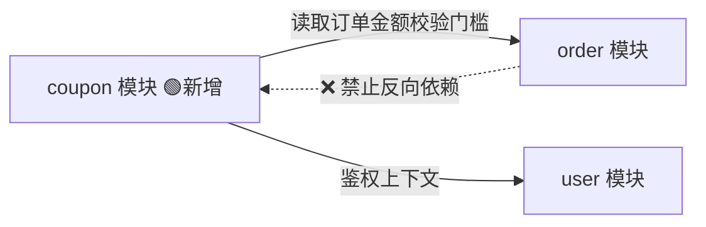
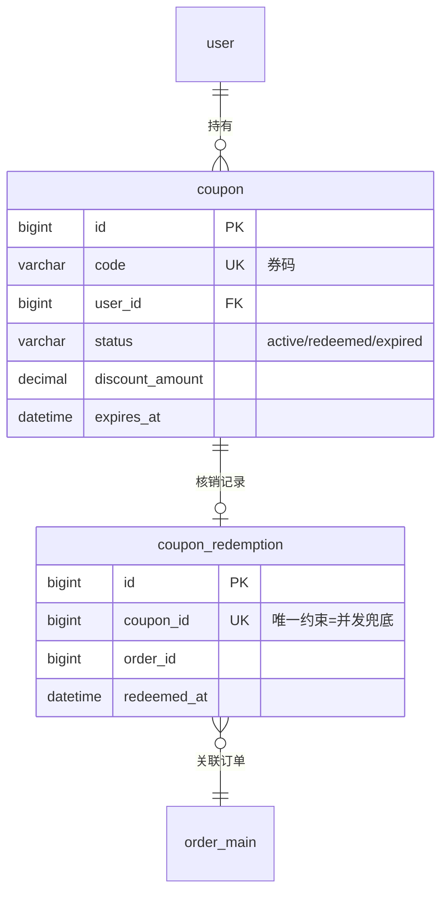
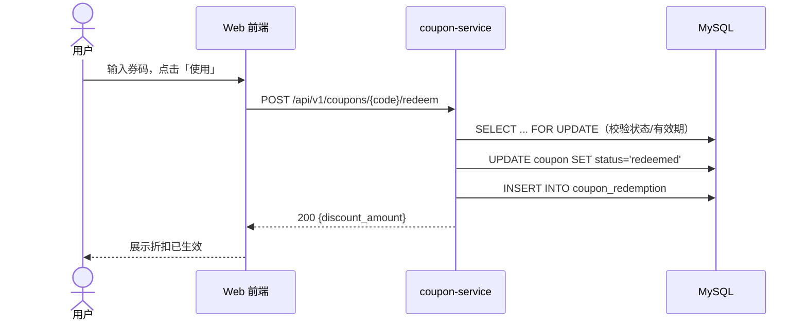

# Worked Example — 一份完整的 REVIEW.md

> 下面是虚构变更 `add-coupon-redemption`（优惠券发放与核销）的成品 REVIEW.md，
> 展示模板各节填到什么粒度。生成时照 [review-template.md](review-template.md)
> 的骨架，粒度对齐本例。

---

# 设计审查 — add-coupon-redemption

> 本文档由 spec 派生，仅供人工审查。任何修改意见请反馈给 planner 回流至 spec 后重新生成，**请勿直接编辑本文档**。

| 元信息 | 值 |
|--------|-----|
| 变更 ID | `add-coupon-redemption` |
| 生成时间 | 2026-06-12 14:30 |
| Spec 版本 | `a3f8c21d09e4` |
| Arch-review | ✅ 已闭环（2 项 P1 已消化进 spec） |
| 状态 | ⏳ 待用户确认（spec-confirm） |

**四件套概览**

| # | 契约 | 本变更是否涉及 | 章节 |
|---|------|----------------|------|
| 1 | 项目结构与模块设计 | ✅ 新增 1 个模块 | §1 |
| 2 | 外部协议（API） | ✅ 新增 2 个端点 | §2 |
| 3 | 数据库设计 | ✅ 新增 2 张表 | §3 |
| 4 | 用例设计 | ✅ 5 个场景 | §4 |

---

## 1. 项目结构与模块设计

新增 `coupon` 模块，目录增量：

```text
src/
├── modules/
│   ├── order/                  （存量，不变）
│   ├── user/                   （存量，不变）
│   └── coupon/                 🟢 新增
│       ├── coupon.controller.ts    # 2 个端点的入口
│       ├── coupon.service.ts       # 核销事务、有效性校验
│       ├── coupon.repository.ts    # DB 访问，FOR UPDATE 封装在此
│       └── coupon.types.ts         # DTO 与错误码定义
└── shared/                     （存量，不变）
```

模块依赖关系（只允许实线方向的调用）：



| 模块 | 职责边界 | 对外接口 |
|------|----------|----------|
| `coupon` | 券的生命周期：领取、核销、过期；核销事务的唯一入口 | `CouponService.redeem()` / `CouponService.listByUser()` |
| `order`（存量） | 不感知优惠券存在；折扣金额由 coupon 模块算好后写入订单 | 不变 |

**关键决策**：order 模块零改动——折扣以「已算好的金额」单向传入，避免双向耦合。代价是订单侧无法主动反查券信息，按当前需求可接受（spec「Scope & Boundaries」节已声明）。

---

## 2. 外部协议（RESTful API）

### 🟢 新增 `POST /api/v1/coupons/{code}/redeem`

| 属性 | 值 |
|------|-----|
| 鉴权 | Bearer Token（登录用户） |
| 幂等性 | 非幂等；重复调用返回 409 |
| 限流 | 10 次/分钟/用户 |

**请求**

```json
{
  "order_id": 10086
}
```

**响应 200**

```json
{
  "coupon_code": "SAVE20-XK9F",
  "discount_amount": "20.00",
  "redeemed_at": "2026-06-12T14:30:00+08:00"
}
```

**错误码**

| HTTP | code | 含义 | 对应场景 |
|------|------|------|----------|
| 404 | `COUPON_NOT_FOUND` | 券码不存在 | — |
| 409 | `COUPON_ALREADY_REDEEMED` | 已被核销 | S2 / S5 |
| 422 | `COUPON_EXPIRED` | 已过期 | S3 |
| 422 | `COUPON_NOT_APPLICABLE` | 不满足订单门槛 | — |

### 🟢 新增 `GET /api/v1/users/me/coupons`

| 属性 | 值 |
|------|-----|
| 鉴权 | Bearer Token |
| 分页 | `?page=1&size=20`，默认 20，上限 100 |

**响应 200**

```json
{
  "items": [
    {
      "coupon_code": "SAVE20-XK9F",
      "title": "满 100 减 20",
      "status": "active",
      "expires_at": "2026-06-30T23:59:59+08:00"
    }
  ],
  "total": 3
}
```

> 存量端点无修改、无废弃。事件/MQ 契约：本变更不涉及。

---

## 3. 数据库设计

实体关系总览：



完整 DDL（已按 dba-guideline 自查：PK / NOT NULL+DEFAULT / 记账三列 / 金额用 DECIMAL / 注释齐全）：

```sql
CREATE TABLE coupon (
    id              BIGINT UNSIGNED NOT NULL AUTO_INCREMENT COMMENT '主键',
    code            VARCHAR(32)     NOT NULL COMMENT '券码，全局唯一',
    user_id         BIGINT UNSIGNED NOT NULL COMMENT '持有用户 ID',
    title           VARCHAR(64)     NOT NULL COMMENT '券名称，如：满100减20',
    status          VARCHAR(16)     NOT NULL DEFAULT 'active' COMMENT '状态: active/redeemed/expired',
    discount_amount DECIMAL(10,2)   NOT NULL COMMENT '抵扣金额（元）',
    threshold_amount DECIMAL(10,2)  NOT NULL DEFAULT 0.00 COMMENT '使用门槛（元），0 表示无门槛',
    expires_at      DATETIME        NOT NULL COMMENT '过期时间',
    created_time    DATETIME        NOT NULL DEFAULT CURRENT_TIMESTAMP COMMENT '创建时间',
    updated_time    DATETIME        NOT NULL DEFAULT CURRENT_TIMESTAMP ON UPDATE CURRENT_TIMESTAMP COMMENT '更新时间',
    is_deleted      TINYINT         NOT NULL DEFAULT 0 COMMENT '逻辑删除: 0-否 1-是',
    PRIMARY KEY (id),
    UNIQUE KEY uk_coupon_code (code),
    KEY idx_coupon_user_id_status (user_id, status)
) ENGINE=InnoDB DEFAULT CHARSET=utf8mb4 COMMENT='优惠券';

CREATE TABLE coupon_redemption (
    id           BIGINT UNSIGNED NOT NULL AUTO_INCREMENT COMMENT '主键',
    coupon_id    BIGINT UNSIGNED NOT NULL COMMENT '优惠券 ID',
    order_id     BIGINT UNSIGNED NOT NULL COMMENT '核销关联的订单 ID',
    redeemed_at  DATETIME        NOT NULL COMMENT '核销时间',
    created_time DATETIME        NOT NULL DEFAULT CURRENT_TIMESTAMP COMMENT '创建时间',
    updated_time DATETIME        NOT NULL DEFAULT CURRENT_TIMESTAMP ON UPDATE CURRENT_TIMESTAMP COMMENT '更新时间',
    is_deleted   TINYINT         NOT NULL DEFAULT 0 COMMENT '逻辑删除: 0-否 1-是',
    PRIMARY KEY (id),
    UNIQUE KEY uk_coupon_redemption_coupon_id (coupon_id),
    KEY idx_coupon_redemption_order_id (order_id)
) ENGINE=InnoDB DEFAULT CHARSET=utf8mb4 COMMENT='优惠券核销记录';
```

**索引预算与扩展性**

| 表 | 索引数 | 预算内 | 关键决策 |
|----|--------|--------|----------|
| `coupon` | PK + 1 UK + 1 普通 | ✅（≤5） | `code` 唯一约束承担业务唯一性 |
| `coupon_redemption` | PK + 1 UK + 1 普通 | ✅ | `coupon_id` 唯一约束实现 S5 并发兜底，**一张券终身只能核销一次**；若未来支持多次核销券型需迁移此约束（已在风险节记录） |

无存量表变更，无大表迁移风险。

---

## 4. 用例设计

> 用户确认本节即确认验收口径：**下列场景全部通过 = 本变更验收完成。**

**执行载体声明**：scripted（Playwright + API 测试，由 quality-assurance 实现）

| ID | 场景 | WHEN（用户动作） | THEN（可观察断言） | DB 影响 | 载体 |
|----|------|------------------|--------------------|---------|------|
| S1 | 正常核销 | 已登录用户对有效优惠券码发起核销 | 返回 200，券状态变为「已使用」，订单页显示折扣 | `coupon_redemption` +1 行；`coupon.status` → `redeemed` | scripted |
| S2 | 重复核销被拒 | 用户对已核销的券码再次发起核销 | 返回 409 `COUPON_ALREADY_REDEEMED`，无任何状态变化 | 无写入 | scripted |
| S3 | 过期券被拒 | 用户对超过 `expires_at` 的券发起核销 | 返回 422 `COUPON_EXPIRED` | 无写入 | scripted |
| S4 | 查询我的优惠券 | 用户打开「我的优惠券」页 | 列表按领取时间倒序展示，已使用/已过期分组置灰 | 只读 | scripted |
| S5 | 并发核销仅一次成功 | 两个请求同时核销同一券码 | 恰好一个 200、一个 409 | `coupon_redemption` 恰好 +1 行 | scripted |

主路径（S1）时序：



**边界说明**：S5 的并发正确性靠 §3 中 `uk_coupon_redemption_coupon_id` 唯一约束兜底，而非应用层锁——这是本变更的关键设计决策之一。

---

## 附：深究指针与确认清单

| 想深究 | 看这里 |
|--------|--------|
| 完整需求与决策依据 | `openspec/changes/add-coupon-redemption/proposal.md` |
| 场景的执行级细节 | `openspec/changes/add-coupon-redemption/specs/coupon/spec.md` |
| Arch-review 意见及消化记录 | `openspec/changes/add-coupon-redemption/arch-review.md` |

**请逐项确认（回复序号即可）：**

- [ ] ① 模块：coupon 单向依赖 order/user 的边界划分
- [ ] ② 协议：2 个新端点的形状、错误语义可接受
- [ ] ③ 库表：2 张新表的结构与「一券一次核销」的唯一约束决策
- [ ] ④ 用例：5 个场景 = 验收定义，无遗漏的关键路径
