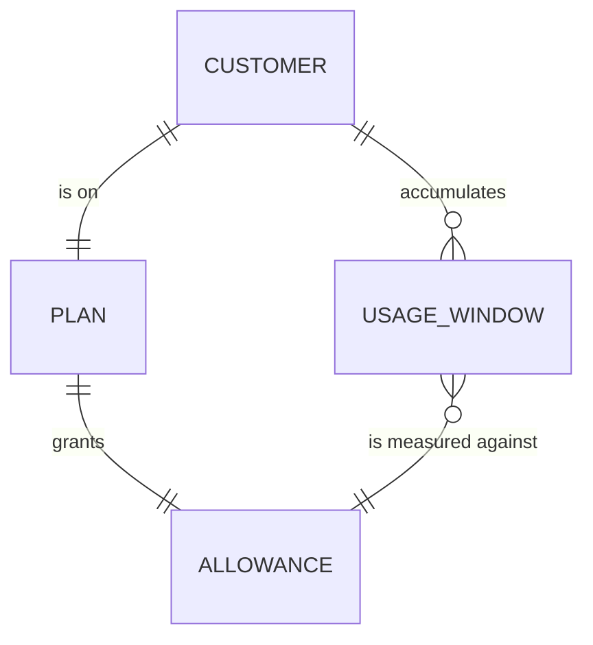
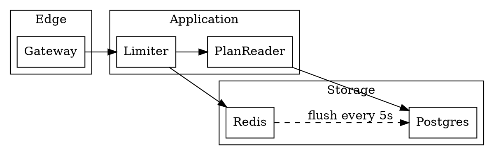
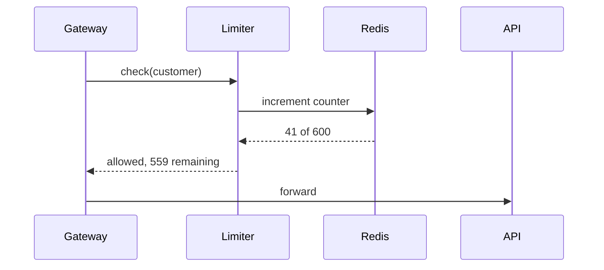
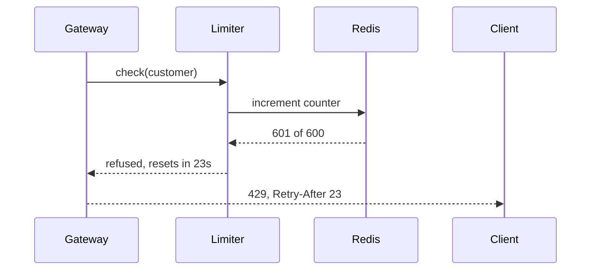

Today any single customer can send as many API requests as they like, and when one of them does,
every other customer's requests slow down with it — twice last quarter. This change gives each
customer an allowance per time window and turns away what goes over it. Two things about how that
allowance is stored and enforced cannot be changed cheaply later, and they are what I need you to
settle.

{/* genai:arch.decisions */}
## What I need you to decide

{/* genai:decision recommend=B */}
### D1 — Where do the counts live: never lose a count, or never slow a request?

A. Count in the database, inside the same transaction as the request it belongs to.
B. Count in Redis (an in-memory store — fast, and its contents are lost if it restarts), and
   write the totals to the database every few seconds.

**Why B**: peak traffic is roughly 12× the daily average, and option A puts a database write on
the critical path of every single request — measured at 6–9ms on the current schema, on calls whose
median is 40ms. Option B costs accuracy in one specific way: if Redis restarts, up to a few seconds
of counts are lost, and a customer gets a few extra requests through. Nobody is billed for those,
and the limit exists to protect the shared system rather than to be exact.

{/* genai:cost */}
**What it costs to get this wrong**: choosing A and finding the latency unacceptable means moving
the counter out of the transaction later — a change to every write path that touches quota, plus a
migration for the counter table, on a system already carrying live traffic. Choosing B and finding
the accuracy unacceptable means the reverse, but the counts are derived rather than authoritative,
so nothing has to be reconciled.

{/* genai:decision recommend=A */}
### D2 — When the counter is unreachable, do requests go through or get turned away?

A. Let them through, and record that the limit was not enforced.
B. Turn them away with the same response an over-limit request gets.

**Why A**: the counter being down is our failure, not the customer's, and B converts a cache
outage into a full outage for every customer at once — the exact failure this change exists to
prevent, arriving by a different road. A leaves a window where a customer could exceed their
allowance unnoticed, which is why the "not enforced" record is part of the option rather than a
detail: without it, nobody learns that it happened.

{/* genai:cost */}
**What it costs to get this wrong**: choosing B means the next Redis incident takes the whole API
down and the cause reads as an application bug rather than an infrastructure one. Choosing A means
a customer can overrun their allowance during an outage; the record is what bounds how long that
goes unnoticed.

{/* genai:arch.background */}
## What you need to know first

**Allowance (quota)** — how many requests one customer may make inside a fixed window. Two numbers:
how many, and how long the window is.

**Window** — a fixed period the allowance resets at, here one minute. A customer with an allowance
of 600 may make 600 requests in any one minute, and the count starts again at the top of the next.

Every API request already carries the customer it belongs to, identified at the edge before any
application code runs, so nothing new has to be worked out to know whose allowance to charge.

The allowance numbers themselves are per plan and set by whoever owns pricing. This change stores
and enforces them; it does not decide what they are.

One question is deliberately not here: whether a customer approaching their limit should be warned,
slowed down, or simply turned away at the line. That is something you will want to see working
before settling, and there will be a running version to react to.

{/* genai:arch.appendix */}
## Appendix — the full design

Everything below is for depth. Nothing in it needs a ruling.

### §0 Domain model



- **Plan** — the commercial tier a customer is on. Already exists; this change reads it.
- **Allowance** — the pair (requests, window length) a plan grants. New.
- **Usage window** — how many requests one customer has made in the window now open. New, and the
  only thing here that changes many times a second.

### §1 Modules



| Module | Owns |
|---|---|
| Limiter | the decision to allow or refuse one request, and nothing else |
| PlanReader | turning a customer into their allowance, cached for a minute |
| flush job | moving counts from Redis to Postgres; the only writer of the totals table |

### §2 Interfaces

| Call | In | Out | Called by |
|---|---|---|---|
| `Limiter.check` | customer id | allowed, remaining, resets-at | the gateway, once per request |
| `PlanReader.allowanceFor` | customer id | requests, window seconds | Limiter |

A refused request answers `429` with `Retry-After` set to the seconds remaining in the window.

### §3 Data

```sql
CREATE TABLE allowance (
  plan_id        TEXT PRIMARY KEY REFERENCES plan(id),
  requests       INTEGER NOT NULL CHECK (requests > 0),
  window_seconds INTEGER NOT NULL CHECK (window_seconds > 0)
);

CREATE TABLE usage_total (
  customer_id  TEXT NOT NULL REFERENCES customer(id),
  window_start TIMESTAMPTZ NOT NULL,
  requests     INTEGER NOT NULL,
  PRIMARY KEY (customer_id, window_start)
);
```

`usage_total` is written only by the flush job and read only for reporting. Nothing on the request
path touches it, which is what D1 option B buys.

### §4 Use cases

<Figure caption="A request inside the allowance">



</Figure>

<Figure caption="A request over the allowance">



</Figure>
