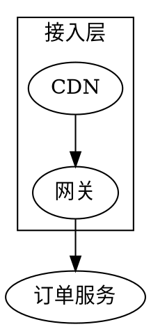
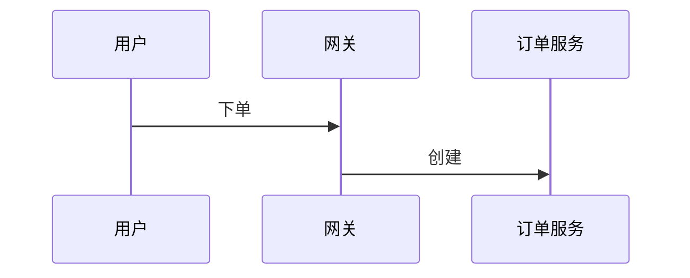

# mdx-artifact — 面向 Agent，为人类输出富文档产物

Agent 产的 Markdown 省 token 但给人看太素。本 skill 让你写 **MDX**（Markdown + 组件标签），由框架**构建期 React SSG** 编译成**配色统一、结构清晰、带轻交互、双击即开、离线自包含**的 HTML。运行时零 React，静态文档依旧轻。

## 核心心智模型

```
你（Agent）写 a.mdx           框架编译（零运行时框架）             人打开 a.html
Markdown + <组件>       →   node render.mjs / npm run render   →   自包含 · 离线 · 可移植
```

你只写 `.mdx`，**不写 CSS、不写 HTML 骨架、不写坐标**。呈现由组件合成。

## 快速开始

首次需 `npm install`（依赖已在 `package.json`，含 React/MDX/Tailwind；KaTeX 已 vendored）。在本 skill 目录下：

```bash
npm install                                  # 仅首次
npm run preview -- path/to/doc.mdx           # 多文档预览：改 mdx 自动刷新，自动开浏览器
npm run preview -- path/to/doc.mdx --root /repo   # 首页列出 root 下所有 .mdx
npm run render  -- path/to/doc.mdx out.html  # 一次性导出自包含 HTML
```

预览地址 `http://localhost:4321/?doc=<路径>`；一个服务托管多篇文档，URL 用 `?doc=` 区分。

## 文档骨架（务必遵循）

**头部（标题/副标题/日期）→ 导语 → 分节正文 → 页脚 → 版本记落款**。frontmatter 有 `title` 即自动生成 Hero 头部；最底部**始终**自动追加一条「版本记落款」（版权 · 撰写 Agent · 生成日期 · 工具授权），无需手写。

```mdx
---
title: 订单系统技术方案          # 头部大标题（必填）
subtitle: 基于消息队列的异步解耦   # 副标题
author: Claude Opus 4.8         # 撰写此文档的 Agent（必填，写你自己的模型名；落款第 1 行注明作者）
org: 平台架构组                  # 版权归属主体（落款第 1 行 © 用它）
date: 2026-07-21                # 可选：文档日期，仅用于 Hero 展示（生成时间由渲染器自动到秒）
palette: lime                   # 主题色：indigo | teal | rose | amber | lime
mode: auto                      # 明暗：light | dark | auto（右上角可手动切换）
toc: true                       # 右侧悬浮目录（从 Section 收集）
footer: 反馈请联系平台架构组。      # 可选：页脚寄语（叙述带；不写则只保留落款）
---

<Hero eyebrow="design · v1" title="订单系统技术方案" sub="基于消息队列的异步解耦" date="2026-07-21 · 平台架构组" stats={[{v:"3",l:"核心服务"},{v:"1.2M",l:"日均订单"}]}>
一句话说清这份文档是什么、给谁看。
</Hero>

本方案面向后端团队……                          <!-- 导语 -->

<Section number="01" eyebrow="背景" title="目标与约束" />
…（关键信息用组件承载：指标→Stat、流程→Steps、对比→Table/Columns、用例→Scenario）…
```

### 必备元信息（生成日期 / 作者 / 版权）

网页产物必须能自证「谁、何时、用什么生成」。渲染器**始终**在页面最底部输出**版本记落款**，分成两行、职责分明：

- **第 1 行 = 使用者的实际信息**（来自你的 frontmatter / 渲染时刻）：`© {年} {org}  ·  由 {author} 撰写  ·  生成于 {到秒的时间}`。
  - **`author`（撰写模型）必填**——用**你自己的模型名**（如 `Claude Opus 4.8`）。缺失会**告警**并以「AI Agent」兜底。
  - **生成时间在渲染那一刻自动捕获、精确到秒**（如 `2026-07-21 14:30:52`），无需也不应手写；frontmatter `date` 只作可选的 Hero 展示日期，与它无关。
- **第 2 行 = ExcaliVibe 固定推广信息**（写死在 skill 里，用户无法配置）：`以 ExcaliVibe · mdx-artifact v{X} 生成 · MIT` + 一个跳转 ExcaliVibe 仓库的 **GitHub 图标**。它是本 skill 的署名与推广，每份产物都带。**不要试图用 frontmatter 覆盖它**。
- `<Footer>…</Footer>` 或 frontmatter `footer:` 是**可选的寄语带**（放致谢 / 联系方式 / 版本说明），显示在落款**之上**；不写就只有落款两行。

## MDX 写法约定（重要，避免踩坑）

- **能用 Markdown 就用 Markdown**：标题 `##`、列表、**任务清单 `- [ ]`**、**表格**（已启用 GFM）、引用、代码围栏、粗斜体行内码链接——直接写，自动上妆。
- **块组件内的散文要用空行分隔**，才会被当 markdown 段落渲染：
  ```mdx
  <Callout tone="warning" title="风险">

  支付回调存在**幂等性**问题。

  </Callout>
  ```
- **数组/对象属性用 `{}`**：`<Hero stats={[{v:"3",l:"服务"}]}>`。
- **公式用属性传 tex**（MDX 会把 `{}` 当表达式）：`<Math tex="\frac{a}{b}" />`。
- **代码用 markdown 围栏**（对 `<` `>` 安全）：<code>```ts</code>；需文件名栏时用 `<Code filename="x.ts">`（但别在其中放裸 `<`）。
- **样式只用语义参数**（`tone` / `ratio` / `status`），不写颜色值。`tone`：`info｜success｜warning｜danger`（Card 另有 `primary`）。
- **行内状态**：散文里直接 `<Badge tone="success" dot>已上线</Badge>`。
- **兜底**：组件覆盖不到时可写原生 HTML（透传），但优先用组件保持一致。

### Block 速览

`Hero` `Footer` `Section` `Callout` `Card`(badge/badgeTone) `Columns` `Toggle` `Steps`/`Step` `Stats`/`Stat` `Fields`/`Field` `Scenario`/`When`/`And`/`Then` `Grid`/`Item`(filterable/facets/tags) `Math` `Code` `Badge` `Figure`(图注)；图用 `dot`/`mermaid`/`svg` 围栏（见「图」节）。

**完整属性与示例见 [`references/blocks.md`](references/blocks.md)；范例见 [`references/example.mdx`](references/example.mdx)。**

## 面向扩展（OCP）

加一个新组件 = 在 [`src/components/registry.mjs`](src/components/registry.mjs) 里写一个函数并在 `components` 映射表追加一行——**核心渲染器不改**。这是本 skill 的架构基石：标签→组件映射天然「对扩展开放、对修改封闭」。交互型组件（如未来的 DataView 虚拟滚动）走 React 岛屿水合，注册表已留好扩展位。

## 图（Diagram）

图用 **fenced code block** 承载（对 `<` / `{}` 天然安全），按围栏语言分派到三条车道。选型只记一句话——**能上 Graphviz 就 Graphviz；它做不了的时序 / 状态机 / 甘特用 Mermaid；都不合适或要手工精确摆放时兜底 SVG**：

| 你要画的 | 围栏语言 | 怎么渲染 |
|---|---|---|
| 流程 / 管线 / 依赖 / 调用 / **类图** / **ER** / **架构分层** / 树·层级 | `dot` | 构建期 → 静态 SVG，**零运行时** |
| **时序图** / 状态机 / 甘特 / 用户旅程 / git 图 | `mermaid` | 客户端渲染（用到才把自包含包内联进该页，离线可用） |
| 自定义 / 特型图形 / 需精确摆放（**兜底**） | `svg` | 原样内联，**零运行时** |

- **默认 Graphviz**：结构 / 关系图占绝大多数，零运行时，且用 `subgraph cluster` / `rank` 让「位置＝逻辑」（架构分层的边界、流程的并行）。
- **Mermaid 只补 Graphviz 的空白**（时序 / 状态机等专用记法）。代价：用到的那一页会内联 mermaid 运行时（~3.4MB，仅该页；没用图的文档零成本）。
- **SVG 是兜底逃生舱**：引擎表达不了、或自动布局「就是不对」时手写 `svg` 围栏；上色用 `currentColor` / CSS 变量（如 `var(--accent)`）即可跟随明暗。
- **图注**：想加标题就包一层 `<Figure caption="…">`（图注在图下方居中）。
- **完整决策表 + 召回词 + tie-breaker（流程默认给谁、状态流转 vs 状态机、图表不在范围）见 [`references/blocks.md`](references/blocks.md)。**

````mdx
<Section number="03" title="部署架构" />



<Figure caption="下单主链路时序">



</Figure>
````

## 硬约束

- **自包含、零外链**：产物不引任何 CDN。KaTeX vendored 到 `assets/vendor/`；React/MDX/Graphviz-wasm 是**构建期**依赖（不进产物，Graphviz 直接烤成静态 SVG）；Mermaid 仅在用到的页把自包含运行时**内联**进该页。运行时无任何外部请求（已用 Playwright 网络面板核实）。
- **不手写 HTML 骨架 / CSS / 坐标**；样式走语义 token。
- **双端同步**：`claude/` 与 `codex/` 两侧镜像一致。
