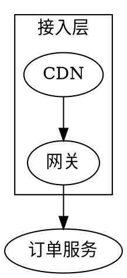
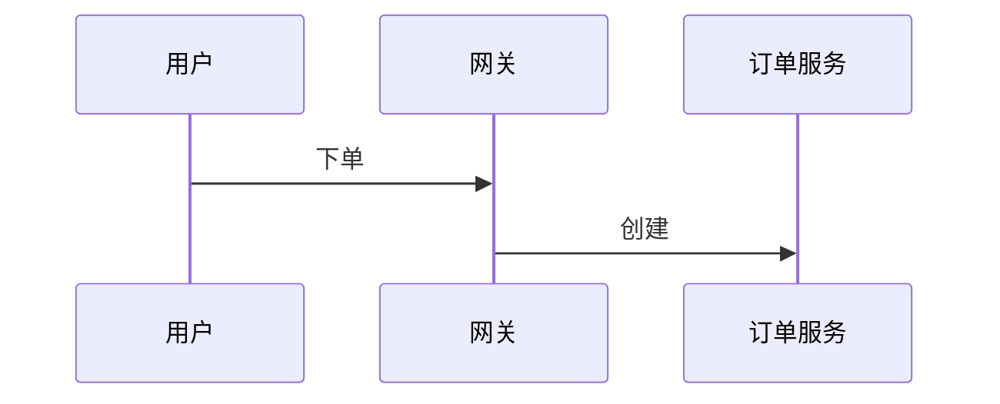

# mdx-artifact — 面向 Agent，为人类输出富文档产物

Agent 产的 Markdown 省 token 但给人看太素。本 skill 让你写 **MDX**（Markdown + 组件标签），交给
**[mdx-viewer](https://github.com/yanxuan-lc/mdx-viewer)**（独立的全局 npm 包）渲染成配色统一、结构清晰、带轻交互的网页，人在浏览器里读。

## 核心心智模型

```
你（Agent）写 a.mdx        →   mdxv a.mdx   →   人在浏览器读（改 mdx 自动刷新）
Markdown + <组件>              全局 CLI          主题化 · 分节导航 · 图 · 公式
```

**你只交付 `.mdx`**——不写 CSS、不写 HTML 骨架、不写坐标，呈现由组件合成。渲染器不在本仓库：**本 skill 只负责「怎么写」与「怎么给人看」**。

## 工具就绪、自检与预览

渲染器是全局命令 `mdxv`，与本仓库解耦，在任意目录都能用：

```bash
command -v mdxv >/dev/null || npm install -g mdx-viewer   # 仅首次；已装则跳过
mdxv --check path/to/doc.mdx   # ① 编译自检——交付前必须先过
mdxv path/to/doc.mdx           # ② 过了才起预览（后台），把 URL 交给用户
mdxv path/to/docs/          # 以目录为根，打开首篇（优先 README/index）；多篇时左侧出文件抽屉
mdxv demo                   # 随包组件总览——想确认某组件长什么样，直接看这个
```

### 交付前先 `--check`，别把打不开的链接交出去

**`mdxv` 起 server 成功不代表文档能编译。** 编译是懒的，只在浏览器请求那篇文档的那一刻才发生。
所以一份编译不过的文档会让 `mdxv` 打出绿色的 `✓ Preview ready` 和一个 URL，而那个 URL 返回
**500**——你会连同「已就绪」一起把一个打不开的链接交给用户，而报错只有对方点开才看到。
`--check` 的全部意义就是把这个失败提前到你还能修的时候。

退出码可以直接分支：

| exit | 含义 | 你该做什么 |
|---|---|---|
| `0` | 全部通过 | 起预览，交付 |
| `1` | 至少一篇编译失败 | 报告里给了 `file:line:column` + 原因，去修，**别交付** |
| `2` | 校验没跑起来（用法错、路径不存在、空目录） | 是你的命令或路径有问题，不是文档的问题 |

报告走 **stdout**，`Error:` 诊断走 **stderr**，所以 `mdxv --check docs/ >report 2>err` 能把
「文档坏了」和「命令调错了」分开。`--check` 也吃目录和 `demo`：`mdxv --check docs/` 逐篇报告、
有任一失败即 `1`，整棵树扫一遍很便宜（几十篇不到一秒），交付一组文档时用它。

若报 `Unknown option: --check`，是 `mdxv` 版本太旧：`npm install -g mdx-viewer@latest` 升级再跑。

### 过了 `--check` ≠ 文档是对的

它只回答「能不能编译」。通过意味着**这篇打得开**，不意味着这篇是对的：

- **能加载但渲染不对**：组件名拼错（`<Callut>`）、非法属性值（`tone="紫色"`）、畸形数学。
- **根本加载不出来**：任何**顶层 ESM 语句**或 `{…}` 表达式在模块求值 / 渲染期失败。

这些只是例子，不是清单。所以 `--check` 过了之后，组件名对不对仍要自己核（对着下面的 Block 速览
或 `mdxv demo`），别把「校验通过」当成「内容没问题」。

- **预览是常驻进程**：**后台启动**（Claude Code 用 Bash 的 `run_in_background`），把它打印的
  `http://localhost:4321/?doc=…` 交给用户，别在前台等它退出。用完主动停掉。
- 常用参数：`--port <n>`（默认 4321）、`--host`、`--no-open`（不自动开浏览器）、`--lang zh-CN|en-US`。
- **不能全局装包时**（权限受限）用免装兜底：`npx -p mdx-viewer mdxv doc.mdx`。
- **多文档树导航**：以目录为根时，正文里指向本地 `.md`/`.mdx`/目录的**相对链接会自动路由**（点击即在预览内互跳；目录链接按 `README.mdx` 索引约定解析），外链/锚点不动——用自然的 Markdown 相对链接就能串起整棵树。注：Markdown 本就是合法 MDX，`.md` 文件也能直接预览。
- **语言变体**：同名兄弟文件加 locale 后缀（`guide.zh-CN.mdx` / `guide.en-US.mdx`）会被合并成一个导航项，按界面语言选中对应变体，缺失时回落无后缀版本。

> 组件与参数的**权威源是 mdx-viewer 本身**（`mdxv --version` 看版本，`mdxv --help` 看当前版本
> 支持哪些选项）。下面的写法约定与 `references/blocks.md` 是精简速查；两者对不上时以包为准，并顺手回修本 skill。

## 文档骨架（务必遵循）

**头部（标题/副标题）→ 导语 → 分节正文 → 页脚寄语 → 落款**。frontmatter 有 `title` 即自动生成 Hero 头部；最底部自动追加**落款**（作者 · 编辑时间 · 版权 + 渲染器署名）。

```mdx
---
title: 订单系统技术方案          # 头部大标题（有它才自动生成 Hero）
subtitle: 基于消息队列的异步解耦   # 副标题
author: Claude Opus 5           # 撰写此文档的 Agent —— 写你自己的模型名
datetime: 2026-07-25 14:30:52   # 你写文档的时刻，精确到秒（见下节，渲染器不会替你生成）
org: 平台架构组                  # 拼进 Hero 的日期行
copyright: 平台架构组            # 落款版权行 © {年} {copyright}
palette: lime                   # 主题色：indigo | teal | rose | amber | lime
mode: auto                      # 明暗：light | dark | auto（右上角可手动切换）
toc: true                       # 右侧悬浮目录（从 Section 收集）—— 仅 >1700px 视口显示，见下
footer: 反馈请联系平台架构组。      # 可选：页脚寄语（显示在落款之上）
---

本方案面向后端团队……                          <!-- 导语，紧跟自动 Hero -->

<Section number="01" eyebrow="背景" title="目标与约束" />
…（关键信息用组件承载：指标→Stat、流程→Steps、对比→Table/Columns、用例→Scenario）…
```

正文里**不要再手写 `<Hero>`**——`title` 已经生成了一个。确实想自己摆 Hero 时，frontmatter 设 `hero: false`（或不写 `title`）避免出现两个。落款同理：它自动渲染，**不要手写 `<Colophon>`**。

**`toc: true` 的悬浮目录在 ≤1700px 视口会隐藏**（避免压正文），也就是说**多数笔记本屏幕上看不到它**。所以：照常开 `toc`（宽屏受益），但**别向用户承诺"右侧有目录"**——文档的可读性要靠 `<Section>` 分节本身撑住，而不是靠目录。

### 落款：`datetime` 必须你自己写

网页产物要能自证「谁、何时写的」。落款由 frontmatter 驱动，**提供才显示**：

- `author` + `datetime` → 「由 {author} 编辑于 {datetime}」；`copyright` → 「© {当年} {copyright}」。
- **`datetime` 没有任何自动兜底**——渲染器只读 frontmatter，不会捕获时间。所以写文档时**自己取当前时间**填进去，格式 `yyyy-MM-dd HH:mm:ss`。漏了就等于这份文档没有时间戳，读者无法判断新鲜度。
- 落款下方固定一行 mdx-viewer 的仓库 · 版本 · 许可证署名，属渲染器自带，frontmatter 无法配置——不用管它。
- `chrome: off` 会关掉自动头尾（连落款一起）；`<Footer>…</Footer>` 或 frontmatter `footer:` 是可选寄语带，显示在落款之上。

## MDX 写法约定（重要，避免踩坑）

- **能用 Markdown 就用 Markdown**：标题 `##`、列表、**任务清单 `- [ ]`**、**表格**（GFM 已启用）、引用、代码围栏、粗斜体行内码链接——直接写，自动上妆；代码围栏走 Shiki 双主题高亮，跟随明暗。
- **正文任何一行都别以 `<` 开头**——这是最容易踩、报错最难懂的一个坑。MDX 把行首的 `<` 当 flow
  级 JSX 解析，**优先级高于跨行未闭合的行内代码**。所以按 ~100 列硬折行时，折点落在含 `<…>` 的
  行内代码中间就会炸：

  ```mdx
  Layered config（离线用 `--out <FILE>`）。`--layer
  <global|tenant|workspace>`（默认 `global`）
  ```

  报 ``Unexpected character `|` (U+007C) in name``——错误信息完全看不出跟折行有关，很难自己定位。
  **修法：把折点移到行内代码之前**，让 `` `--layer <global|tenant|workspace>` `` 整段落在一行。
  围栏代码块内不受影响（``` 里的 `<`、`import` 都是纯文本，写文档讲代码完全正常）。
  自检用 `grep -nE '^<[^A-Z/]' doc.mdx`：组件（`<Section`）与闭合标签（`</Callout>`）首字母大写或
  以 `</` 开头，被排除掉了，所以命中的只会是**故意写的小写原生 HTML / `<svg>` 块**（合法）或者
  这个坑（`<global|…`）。别用 `grep '^<'`——那会把每个组件行都算上，几十上百条噪声，等于没有自检。
- **块组件内的散文要用空行分隔**，才会被当 markdown 段落渲染：
  ```mdx
  <Callout tone="warning" title="风险">

  支付回调存在**幂等性**问题。

  </Callout>
  ```
- **数组/对象属性用 `{}`**：`<Hero stats={[{v:"3",l:"服务"}]}>`。
- **公式**：官方语法 `$E=mc^2$` / `$$…$$` 直接可用；行内 `{`/`_` 容易被 MDX 当表达式吃掉时，改用属性传递：`<Math tex="\frac{a}{b}" />`。
- **代码用 markdown 围栏**（对 `<` `>` 安全）：<code>```ts</code>；需文件名栏时用 `<Code filename="x.ts">`，此时别在 children 里放裸 `<` 或 `{`（MDX 会当 JSX/表达式），要放字面量就用 `` {`…`} `` 模板字符串。
- **样式只用语义参数**（`tone` / `ratio` / `status`），不写颜色值。`tone`：`info｜success｜warning｜danger`（Card 另有 `primary`）。
- **行内状态**：散文里直接 `<Badge tone="success" dot>已上线</Badge>`。
- **兜底**：组件覆盖不到时可写原生 HTML（透传），但优先用组件保持一致。

### Block 速览

`Hero` `Footer` `Section` `Callout` `Card`(badge/badgeTone) `Columns` `Toggle` `Steps`/`Step` `Stats`/`Stat` `Fields`/`Field` `Scenario`/`When`/`And`/`Then` `Grid`/`Item`(filterable/facets/tags) `Math` `Code` `Badge` `Figure`(图注)；图用 `dot`/`mermaid`/`svg` 围栏（见「图」节）。

**完整属性与示例见 [`references/blocks.md`](references/blocks.md)；范例见 [`references/example.mdx`](references/example.mdx)；想看渲染效果直接 `mdxv demo`。**

## 图（Diagram）

图用 **fenced code block** 承载（对 `<` / `{}` 天然安全），按围栏语言分派到三条车道。选型只记一句话——**能上 Graphviz 就 Graphviz；它做不了的时序 / 状态机 / 甘特用 Mermaid；都不合适或要手工精确摆放时兜底 SVG**：

| 你要画的 | 围栏语言 | 怎么渲染 |
|---|---|---|
| 流程 / 管线 / 依赖 / 调用 / **类图** / **ER** / **架构分层** / 树·层级 | `dot` | 构建期 Graphviz(wasm) → 静态 SVG |
| **时序图** / 状态机 / 甘特 / 用户旅程 / git 图 | `mermaid` | 客户端渲染，主题跟随明暗 |
| 自定义 / 特型图形 / 需精确摆放（**兜底**） | `svg` | 原样内联 |

- **默认 Graphviz**：结构 / 关系图占绝大多数，且能用 `subgraph cluster` / `rank` 让「位置＝逻辑」（架构分层的边界、流程的并行）。
- **Mermaid 只补 Graphviz 的空白**（时序 / 状态机等专用记法）。
- **SVG 是兜底逃生舱**：引擎表达不了、或自动布局「就是不对」时手写 `svg` 围栏；上色用 `currentColor` / CSS 变量（如 `var(--accent)`）即可跟随明暗。
- **图注**：想加标题就包一层 `<Figure caption="…">`（图注在图下方居中）。每张图右上角自带全屏放大按钮（滚轮缩放、拖拽平移、Esc 关闭），三种车道都有，作者无需做任何事。
- **完整决策表 + 召回词 + tie-breaker（流程默认给谁、状态流转 vs 状态机、图表不在范围）见 [`references/blocks.md`](references/blocks.md)。**

````mdx
<Section number="03" title="部署架构" />


```dot
digraph { rankdir=TB
  subgraph cluster_edge { label="接入层"; CDN; 网关 }
  CDN -> 网关 -> 订单服务
}
```

<Figure caption="下单主链路时序">


```mermaid
sequenceDiagram
  用户->>网关: 下单
  网关->>订单服务: 创建
```

</Figure>
````

## 边界

- **产物是 `.mdx`，不是 HTML**：不要手写 HTML 骨架 / CSS / 坐标，也不要为了「给人看」另造一个页面——MDX 是唯一的源，`mdxv` 是查看方式。
- **组件不够用时先想能不能组合**现有 Block；真要加新组件，那是上游 mdx-viewer 的事（在它的 `src/app/components/blocks.tsx` 加组件 + `mdx-components.tsx` 映射表加一行，核心管线不动）——不要在本仓库重造渲染器。
- **双端同步**：`claude/` 与 `codex/` 两侧镜像一致（description 可各自适配）。
