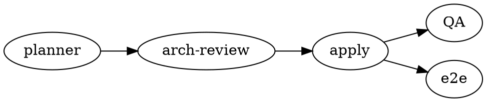
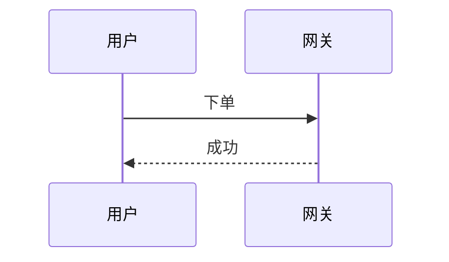

# mdx-artifact · Block API 速查（MDX）

写 `.mdx` 时的组件参考。**原则：散文/标题/列表/任务清单/表格/代码/引用直接写 Markdown；富块、布局、交互、公式用组件标签。** 样式只用语义枚举，不写颜色值。

## MDX 通用约定（先读）

- **块组件内的散文要空行分隔**才当 markdown 段落渲染（见下例）。
- **数组/对象属性用 `{}`**：`stats={[{v:"3",l:"服务"}]}`。
- **公式用属性 `tex`**：`<Math tex="\frac{a}{b}" />`（MDX 把 `{}` 当表达式，不能把 LaTeX 写进 children）。
- **代码用 markdown 围栏**（对 `<>` 安全）；自闭合组件写 `/>`。
- Markdown 原生（自动上妆）：`## / ### / ####`、`**粗**`/`*斜*`/`` `码` ``/`[链](url)`、`- / 1.`、任务清单 `- [ ]`、GFM 表格、`>` 引用、`---`、代码围栏 <code>```lang</code>。

---

## frontmatter

| 字段 | 取值 |
|---|---|
| `title` | 文档标题（自动 Hero） |
| `author` | **必填** · 撰写此文档的模型（如 `Claude Opus 4.8`）。缺失告警 + `AI Agent` 兜底 |
| `org` | 版权归属主体（落款第 1 行 `©` 用它） |
| `copyright` | 可选 · 整行版权文案覆盖（默认 `© {年} {org}`） |
| `date` | 可选 · 文档日期，仅用于 Hero 展示（与自动生成时间戳无关） |
| `subtitle` | 头部副标题 |
| `footer` | 可选 · 页脚寄语（叙述带，显示在落款之上） |
| `palette` | `indigo`(默认)｜`teal`｜`rose`｜`amber`｜`lime` |
| `mode` | `light`(默认)｜`dark`｜`auto`（右上角可手动切换并记忆） |
| `density` | `comfortable`(默认)｜`compact` |
| `toc` | `true` 右侧悬浮目录 |
| `chrome` | `off` 关掉自动头尾（连同落款一并关闭） |

> **版本记落款始终自动输出**在页面最底部，两行分区：
> 1. **用户信息**：`© {年} {org} · 由 {author} 撰写 · 生成于 {到秒的时间戳}`（时间在渲染时自动捕获、精确到秒，无需手写）。
> 2. **ExcaliVibe 固定推广**：`以 ExcaliVibe · mdx-artifact v{X} 生成 · MIT` + 跳 ExcaliVibe 仓库的 GitHub 图标（写死在 skill 内，frontmatter 无法覆盖）。
>
> `chrome: off` 时整条落款不输出。

## Hero
`eyebrow` `title` `sub` `date` `dark`(布尔) `stats={[{v,l}]}`；children = 描述段。
```mdx
<Hero eyebrow="design · v1" title="订单系统" sub="异步解耦" date="2026-07-21" stats={[{v:"1.2M",l:"日均订单"}]}>
一句话说清这份文档。
</Hero>
```

## Footer（可选寄语带）
children = markdown。**可选**——放致谢 / 联系方式 / 版本说明，显示在版本记落款**之上**。不写则页面底部只有自动落款（版权 · 撰写 Agent · 生成日期 · 工具授权，见 frontmatter 表下方说明）。也可用 frontmatter `footer:` 写单行寄语。
```mdx
<Footer>

反馈请联系 **平台架构组**；更新记录见 CHANGELOG。

</Footer>
```

## Section
`number` `eyebrow` `title` `anchor`。自闭合，进目录。
```mdx
<Section number="02" eyebrow="架构" title="服务与数据" />
```

## Callout
`tone`(info｜success｜warning｜danger) `title`。**内容空行分隔**。
```mdx
<Callout tone="warning" title="风险">

支付回调存在**幂等性**问题，需在 T1 前解决。

</Callout>
```

## Badge（行内）
`tone` `dot`(布尔)。写在散文里。
```mdx
当前状态 <Badge tone="success" dot>已上线</Badge>。
```

## Card
`tone`(可 primary) `title` `badge` `badgeTone`（角标渲染在右上角）。
```mdx
<Card tone="primary" title="关键指标" badge="v1.0" badgeTone="success">

<Stat value="99.95%" label="可用性" delta="+0.1" dir="up" />

</Card>
```

## Columns
`ratio`：`1:1`｜`2:1`｜`1:2`｜`1:1:1`。每个直接子块 = 一列。
```mdx
<Columns ratio="2:1">
<Card title="左（宽）">…</Card>
<Card title="右（窄）">…</Card>
</Columns>
```

## Toggle
`title` `open`(布尔)。折叠块。
```mdx
<Toggle title="展开：术语表">
<Fields><Field k="SLO" v="服务级目标" /></Fields>
</Toggle>
```

## Steps / Step
`Step`：`title` `status`(done｜active｜省略)；children = 描述。
```mdx
<Steps>
<Step title="下单" status="done">校验库存与价格</Step>
<Step title="支付" status="active">调用支付网关</Step>
<Step title="发货">生成履约单</Step>
</Steps>
```

## Stats / Stat
`Stat`：`value` `label` `delta` `dir`(up｜down)。多个包在 `<Stats>`。
```mdx
<Stats>
<Stat value="1.2M" label="日均订单" delta="+8%" dir="up" />
<Stat value="240ms" label="P99 延迟" delta="-12%" dir="down" />
</Stats>
```

## Fields / Field
`Field`：`k` `v`。
```mdx
<Fields>
<Field k="runtime" v="Node 20 / TypeScript" />
<Field k="storage" v="MySQL 8 + Redis" />
</Fields>
```

## Scenario
`title`；子标签 `<When>/<And>/<Then>`（可多条）。
```mdx
<Scenario title="Scenario: 用户提交订单">
<When>用户点击「提交」且库存充足</When>
<And>支付渠道可用</And>
<Then>创建订单并返回 created 状态</Then>
</Scenario>
```

## Grid / Item
`Grid`：`filterable`(布尔) `facets="id:标签,id:标签"`；`Item`：`tags`（空格分隔）。
```mdx
<Grid filterable facets="desc:描述性,diag:诊断性,pred:预测性">
<Item tags="desc">趋势分析</Item>
<Item tags="desc diag">漏斗分析</Item>
</Grid>
```

## Math
`tex`（LaTeX，构建期 KaTeX 预渲染 + 字体内联）；`display="inline"` 转行内。
```mdx
<Math tex="\text{QPS}_{\max} = \frac{N}{\bar{t}} \times \eta" />
```

## Code（带文件名）
`filename`；children = 代码（**别放裸 `<`**，含泛型请改用 markdown 围栏）。
```mdx
<Code filename="config.json">{ "port": 8080 }</Code>
```
一般代码用 markdown 围栏（对 `<>` 安全）：<code>```ts order.ts</code> … <code>```</code>

## 图（Diagram）：三车道 + 场景路由

图用 **fenced code block** 承载，围栏语言决定引擎（对 `<`/`{}` 天然安全，别用 `<Diagram>` 组件传源码）。

**一句话原则**：能上 **Graphviz** 就 Graphviz；它做不了的**时序/状态机/甘特**用 **Mermaid**；都不合适或要**手工精确摆放**时兜底 **SVG**。

### 场景 → 围栏语言（决策表）

| 你要画的 | 语言 | 渲染 / 运行时 |
|---|---|---|
| 流程图 / 管线 / 审批流 / 工作流 | `dot` | 构建期→静态 SVG · 零运行时 |
| 依赖 / 调用链 / 模块关系 / DAG / 有向图 | `dot` | 同上 |
| 类图（UML class）/ 继承·关联 | `dot`（`shape=record`） | 同上 |
| ER 图 / 数据模型 / 表关系 | `dot`（`record` + crow's-foot） | 同上 |
| 系统架构 / 分层架构 / 部署拓扑 / 服务边界 | `dot`（`subgraph cluster`＝边界） | 同上 |
| 树 / 层级 / 组织架构 / 目录树 / 决策树 | `dot` | 同上 |
| **时序图 / 序列图 / 交互时序**（生命线、alt/loop） | `mermaid` | 客户端 · 用到才内联运行时（~3.4MB/页） |
| **状态机 / statechart**（复合状态、事件转移） | `mermaid` | 同上 |
| 甘特 / 排期 / 时间线 / 用户旅程 / git 分支图 | `mermaid` | 同上 |
| 自定义示意 / 概念图 / 坐标·几何 / 标注图 / 图形拼合（**兜底**） | `svg` | 原样内联 · 零运行时 |

### 召回词（想到这些词就用对应车道）

- **`dot`（Graphviz）**：流程图、管线、pipeline、审批流、依赖关系、调用链、模块关系、类图、class diagram、ER 图、数据模型、表关系、架构图、系统架构、分层架构、部署图、拓扑、服务边界、组织架构、树形/层级、DAG、有向图
- **`mermaid`**：时序图、序列图、sequence、交互时序、生命线、状态机、statechart、状态流转（带事件）、甘特图、gantt、排期、时间线、timeline、用户旅程、journey、git 分支图
- **`svg`**：自定义示意图、概念图、坐标图、几何示意、标注图、示意图、需要精确摆放、非标准图、图形拼合

### tie-breaker（重叠区判定）

1. **流程图**：mermaid 也能画，但**默认 `dot`**——零运行时 + 可用 `cluster`/`rank` 控位置。仅当出现泳道/复杂条件片段等偏交互记法时才 `mermaid`。
2. **状态流转 vs 状态机**：只是"方框+箭头流转"→ `dot`；要"复合/嵌套状态、事件标注转移"的正式 statechart → `mermaid`。
3. **数据图表**（饼/柱/折线）：**不在图引擎范围**（属未来 DataView）。极简饼图可临时用 mermaid `pie`，但图表 ≠ 关系图，别用 dot/svg 硬凑。

### 用法

- `dot`：渲染器自动注入主题化默认（圆角填充节点、accent 簇标、muted 边）并把颜色映射为 CSS 变量→跟随明暗；作者显式设色会覆盖默认。
- `svg`：用 `currentColor` 或 `var(--accent)`/`var(--ink)` 等上色即自动适配明暗。
- **图注**：包一层 `<Figure caption="…">`，图注居中显示在图下方。

````mdx


<Figure caption="下单主链路时序">



</Figure>

```svg
<svg viewBox="0 0 120 40"><rect x="4" y="4" width="112" height="32" rx="6" fill="var(--surface-2)" stroke="var(--accent)"/><text x="60" y="25" text-anchor="middle" fill="var(--ink)">自定义</text></svg>
```
````

---

## 扩展新组件（OCP）
在 `src/components/registry.mjs` 写一个 React 函数（`React.createElement`），在 `components` 映射表追加 `标签名: 组件`。核心渲染器无需改动。
