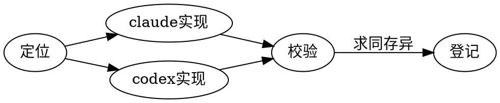

<Hero eyebrow="a Vibe Working relic, like Excalibur" title="ExcaliVibe ⚔️" sub="Excalibur + Vibe —— 一套 Vibe Working 能力套件" date="双端支持 · Claude Code + Codex" stats={[{v:"2",l:"双端 Agent"},{v:"3",l:"能力插件"},{v:"9",l:"研发 subagent"}]}>
源于 Vibe Coding，但不止于编码：面向更广的业务场景，用各自 Agent 的 marketplace + plugin 机制把能力装进去。
</Hero>

同一个能力在 Claude 与 Codex 两侧解决同样的问题、走同样的主流程，只是各用最契合的 primitives 落地——这就是「求同存异」。

<Section number="01" eyebrow="最高原则" title="求同存异" />

<Callout tone="info" title="Seek common ground while preserving differences">

**求同**：架构与主流程两侧一致。**存异**：实现细节各自最优——绝不为了对齐，把某一侧的能力拉低到折中方案。

</Callout>

<Section number="02" eyebrow="能力矩阵" title="三个插件" />

<Card tone="primary" title="gen-ai-development" badge="2.0" badgeTone="success">

生成式 AI 开发工作流套件。核心是**自治控制器**：按「变更原型 × 关键度 × 可逆性」给每个任务定自动化档位，再组装轨道与人审门。范式 = SDD + TDD，落在三层架构上。

</Card>

<Card title="plugin-infra" badge="v0.3.0" badgeTone="success">

通用基础设施：浏览器自动化（Chrome DevTools / Playwright MCP，Claude 侧加 graceful-browser 决策层）+ **mdx-artifact 富文档产物生成**（本页就是它做的）。

</Card>

<Card title="opc-workflow" badge="暂无技能" badgeTone="warning">

一人公司（One-Person-Company）工作流：面向内容 / 运营等非研发场景的能力位。

</Card>

<Section number="03" eyebrow="工程" title="项目结构" />

<Fields>
<Field k="双端镜像" v="claude/ 与 codex/ 各一套，主流程一致" />
<Field k="流程规范" v="内置 OpenSpec + opsx:* 命令" />
<Field k="清单位置" v="两侧 marketplace 清单在仓库根，可从 GitHub 一键安装" />
</Fields>

<Section number="04" eyebrow="上手" title="安装" />

**Claude Code**：

```bash
claude plugin marketplace add yanxuan-lc/excalivibe
claude plugin install gen-ai-development@excalivibe
```

**Codex**（CLI v0.117.0+）：

```bash
codex plugin marketplace add yanxuan-lc/excalivibe
codex plugin add gen-ai-development@excalivibe
```

<Section number="05" eyebrow="度量" title="容量模型" />

容量按峰值 QPS 估算，单实例吞吐见下式：

<Math tex="\text{QPS}_{\max} = \frac{N_{\text{worker}}}{\bar{t}_{\text{req}}} \times \eta" />

| 指标 | 目标 | 当前 |
|---|---|---|
| 可用性 | 99.95% | 99.97% |
| P99 延迟 | 240ms | 228ms |

<Section number="06" eyebrow="流程" title="新增一个能力" />

<Steps>
<Step title="定位" status="done">决定能力属于哪个 plugin、用哪种 primitive</Step>
<Step title="双端实现" status="active">claude/ 与 codex/ 同步落地，主流程对齐</Step>
<Step title="登记">两侧 marketplace / plugin 清单同步追加</Step>
</Steps>

<Figure caption="双端同步主流程（Graphviz 构建期静态出图）">



</Figure>

<Section number="07" eyebrow="附录" title="能力索引" />

<Grid filterable facets="infra:基础设施,dev:研发,ops:运营">
<Item tags="dev">gen-ai-development</Item>
<Item tags="infra">plugin-infra</Item>
<Item tags="ops">opc-workflow</Item>
</Grid>

<Footer>

本页由 plugin-infra 的 **mdx-artifact** skill 生成（自产自销）——下方落款为渲染器自动追加。

</Footer>
