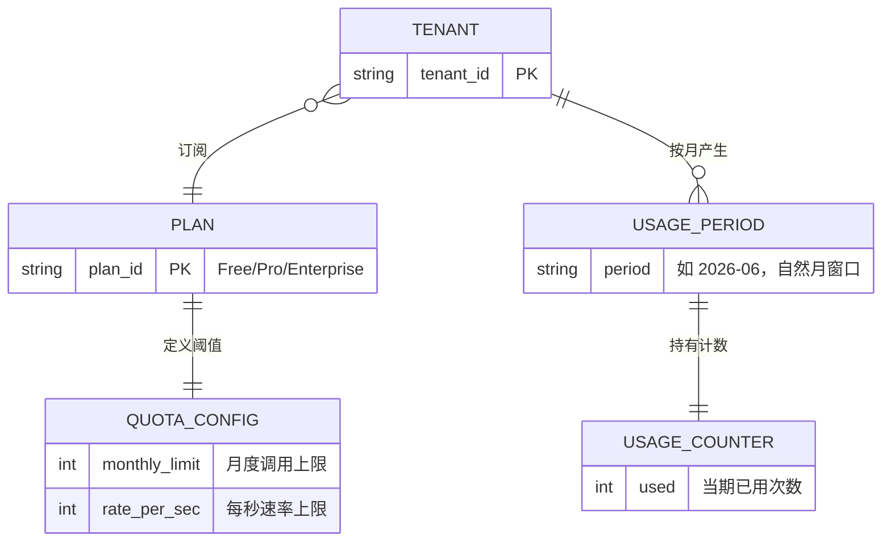
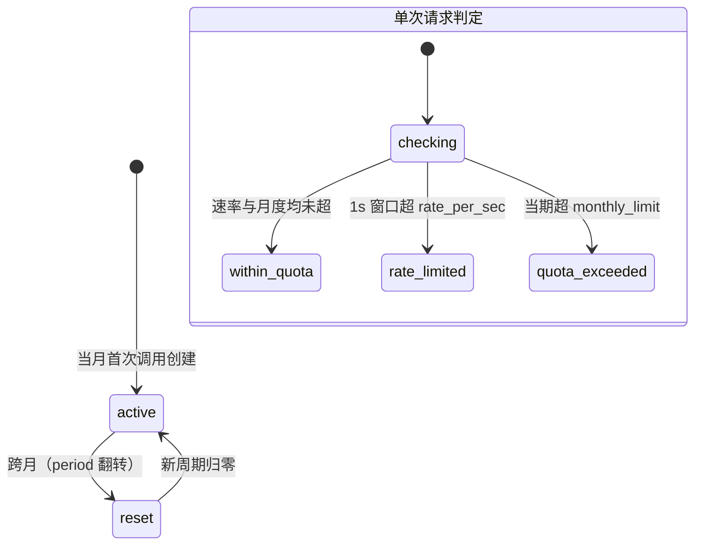
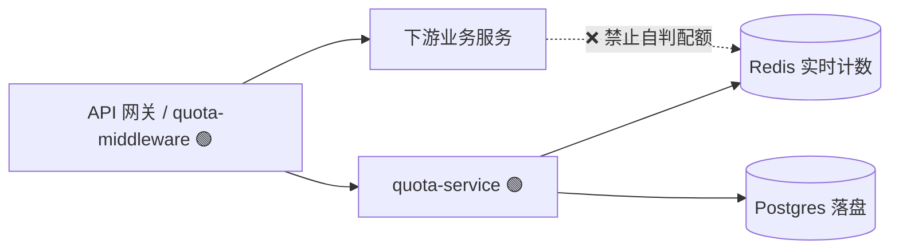
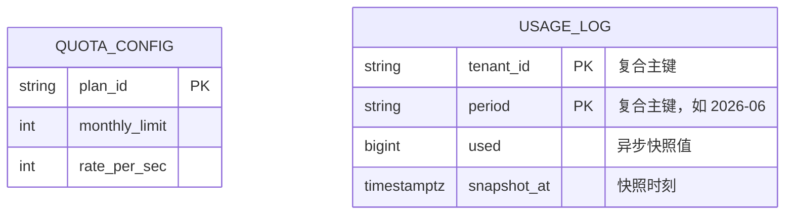
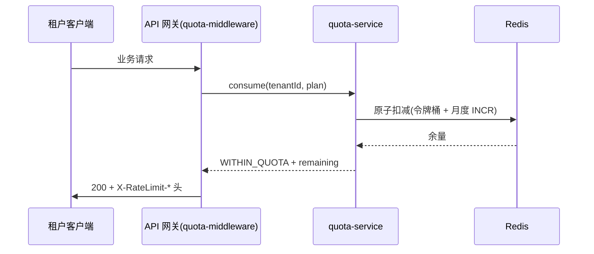

# Worked Example — 一份完整的 REVIEW.md（novel-core 满档）

> 下面是虚构变更 `add-tenant-api-quota`（多租户 API 调用配额限制）的成品 REVIEW.md，
> 展示 novel-core（新颖核心）档位下模板各层填到什么粒度。生成时照
> [review-template.md](review-template.md) 的骨架，粒度对齐本例。
> 注意三条硬要求贯穿全文：**图 > 表 > DSL > 文字**、**自包含**、**术语首现双语**。

---

# 架构评审 — add-tenant-api-quota

> 本文档由 spec（机器可读的设计产物）**单向派生**，仅供人工审查。修改意见请反馈给
> planner 回流至 spec 后重新生成，**请勿直接编辑本文档**（直接编辑会产生第二份事实源）。

| 元信息 | 值 |
|--------|-----|
| 变更 ID | `add-tenant-api-quota` |
| 生成时间 | 2026-06-28 10:42 |
| Spec 版本 | `a3f8c19e0b22` |
| 关键度 | core ｜ 自治档位 human-gated |
| Arch-review（AI 设计预审）| ✅ 已闭环（3 项已消化进 spec）|
| 状态 | ⏳ 待人工评审（架构门）|

**本文档分四层**：① 框定（背景边界）→ ② 结构（领域模型 + 四契约，描述「设计是什么」）
→ ③ 审议（关键决策的备选与权衡，评「为什么这么选」）→ ④ 横切（质量视角，每项给可测场景）。

**概览**

| 层 / 契约 | 本变更是否涉及 | 章节 |
|---|---|---|
| ① 框定 | ✅ | ① |
| ②§0 领域模型 | ✅ | §0 |
| ②§1 模块设计 | ✅ | §1 |
| ②§2 接口设计 | ✅ | §2 |
| ②§3 数据库设计 | ✅ | §3 |
| ②§4 用例设计 | ✅ | §4 |
| ③ 关键决策 | ✅ 4 条 | ③ |
| ④ 横切质量 | ✅ 触发 5 项 | ④ |

---

## ① 框定层

**背景与范围**：本平台是一套 **SaaS（Software as a Service，多租户共用同一套后端、按租户隔离数据的在线服务）**。
不同**租户（Tenant，即一个付费客户组织）**订阅不同套餐（Free / Pro / Enterprise）。本变更在已有的
**API 网关（API Gateway，所有外部请求的统一入口与转发层）**侧，按套餐对每个租户的 API 调用做配额限制，
并把用量读出来供租户自查。

**目标 / 非目标（Goals / Non-Goals）**

| ✅ 目标 | ❌ 非目标（本可做、显式排除）|
|---|---|
| 同时强制「月度调用配额」与「每秒速率」两道限制，按租户独立计数 | 超额计费 —— 归 billing（出账）系统，本变更只产生用量数据 |
| 暴露用量自省接口 `GET /v1/usage` | 按单个 endpoint 的细粒度配额（只做租户总量级） |
| 配额阈值按套餐可配置（Free / Pro / Enterprise 各异） | 对内部 / 管理类调用计配额（这类调用豁免） |

**约束（Constraints）**：① 前置已有 API 网关，新逻辑挂在网关层；② 主存储为
**Postgres（PostgreSQL，关系型数据库）**；③ **Redis（内存键值存储，常用于计数与限流）**可用；
④ 配额检查给请求新增的延迟 **P99（99 分位）≤ 5ms**；⑤ 单个节点崩溃不得整段丢失计数。

---

## ② 结构层

### §0 领域模型（Domain Model）——后续四契约对照它评

> 这是评审的**参考框架**：模块/接口/库表/用例是否「合理」，都相对这里的领域模型而言。

- **限界上下文（Bounded Context）**：本变更属 **Metering（计量）** 上下文——负责「记录并裁决用量」。
  它与相邻的 **Billing（出账）** 上下文边界清晰：Metering 只回答「这次调用放不放、当前用了多少」，
  **绝不**回答「该收多少钱」。越额是否产生费用、如何计费由 Billing 决定，Metering 只把用量事实交出去。
  （限界上下文 = 同一个词在不同业务范围里含义不同，故划定的语义边界。）
- **领域关系**：核心概念关系如下。



- **聚合与不变式（Aggregate & Invariant）**：核心聚合的不变式及其强制强度如下。
  （聚合 = 一组必须一起保持一致的对象；不变式 = 任何时刻都必须为真的业务规则。）

| 编号 | 不变式 | 强制强度 |
|---|---|---|
| I1 | `used ≤ monthly_limit`（当期用量不超月度上限） | **最终一致（Eventual Consistency）**——fail-open 期可短暂越界，事后对账 |
| I2 | 一个 counter 唯一属于某个 `(tenant, period)` | **强一致（Strong Consistency）** |
| I3 | 任一 1 秒窗口内的消费 ≤ `rate_per_sec` | **强一致** |

> I1 标「最终一致」是关键评审点：它意味着允许短暂越界，直接决定了 §3 的存储选型（Redis 实时 + 异步落盘）
> 与 ④ 的失败 / fail-open 取舍。I2、I3 标「强一致」，必须靠原子操作即时强制。

- **状态与生命周期**：`USAGE_PERIOD`（计量周期）的状态机，以及单次请求的判定路径。



### §1 模块设计（Module Design）

- **目录 / 包增量**（🟢 新增）：

```text
gateway/
  middleware/
    quota-middleware.go      🟢 网关层拦截，转调 quota-service 裁决
services/
  quota-service/             🟢 计量上下文唯一裁决者
    check.go                 🟢 速率 + 月度判定（面向抽象）
    consume.go               🟢 原子扣减 / 计数
    usage.go                 🟢 用量自省
  (其余业务服务)              存量，不变
```

- **依赖方向**：允许的调用方向如下；**下游业务服务自行判配额是禁止的**（虚线 + ❌）。



- **职责边界表**：

| 模块 | 边界（一句话） | 对外入口 |
|---|---|---|
| quota-middleware | 网关层薄拦截，不含业务判定逻辑，只转调 quota-service | HTTP 中间件钩子 |
| quota-service | Metering 上下文唯一的配额裁决者，封装「计数存哪」 | `check()` / `consume()` / `usage()` |

- **对照 §0**：模块拆分对齐 Metering 上下文——裁决权收敛在 `quota-service` 单个模块，下游服务一律不自判，
  契合「Metering 是唯一裁决者」的上下文边界。核心能力面向抽象：`check / consume / usage` 是稳定接口，
  内部换存储（Redis ↔ 其他）不破坏调用方。

### §2 接口设计（Interface Design）

> 评两件事：**(a) 业务领域划分是否合理**（接口有没有切在领域概念的关节上）；
> **(b) 扩展性 / 第三方接入**（未来扩展、对外开放 OpenAPI 的合理性与复杂度）。

- **接口面按关注点切分**：

| 接口面 | 操作 | 受众 / 信任级别 | 变更频率 |
|---|---|---|---|
| 用量自省 | `GET /v1/usage` | 外部租户（已认证） | 低 |
| 配额管理 | `GET·PUT /v1/plans/{id}/quota` | 平台管理员 | 低 |
| 强制执行 | `quota-service.check() / consume()` | 内部抽象（网关调用） | 内部演进 |

- **关键契约形状**：

```jsonc
// GET /v1/usage —— 租户自省当期用量（四元组）
{
  "tenant_id": "t_8f3a",
  "period": "2026-06",
  "monthly": { "limit": 100000, "used": 42317, "remaining": 57683 },
  "rate": { "per_sec": 50 }
}

// quota-service.consume() —— 内部抽象契约（屏蔽计数存哪）
// consume(tenantId, plan) -> Decision
{
  "decision": "WITHIN_QUOTA",        // | RATE_LIMITED | QUOTA_EXCEEDED
  "remaining_month": 57682,          // 扣减后剩余
  "retry_after_ms": null             // RATE_LIMITED 时给值
}
```

- **抽象边界**：`check / consume / usage` 三个内部接口屏蔽了「计数存在 Redis 还是 PG、如何原子扣减」
  的实现细节——调用方（网关）只见决策，不见存储，换实现不破坏调用方。
- **版本与扩展**：

| 维度 | 约定 |
|---|---|
| 版本路径 | `/v1/`，对外 spec 用 OpenAPI 3.1 |
| 兼容策略 | 响应字段只增不改（additive） |
| 预留扩展点 | 「按 endpoint 配额」= 未来给 quota-config 加一个可选维度，不动现有接口形状 |
| 限流响应头 | `X-RateLimit-Limit / -Remaining / -Reset`（事实标准头） |

- **统一约定**：所有错误走统一错误信封 `{ "error": { "code": "...", "message": "...", "request_id": "..." } }`。

### §3 数据库设计（Database Design）

- **总览**：持久化只有两张表；**实时计数器不落库，活在 Redis**（见下方对照 §0）。



- **完整 DDL**（已自查（dba-guideline）：主键显式、计数列用 `BIGINT` 防溢出、时间列带时区、无大字段、
  复合主键即天然唯一约束）：

```sql
CREATE TABLE quota_config (
    plan_id       TEXT    PRIMARY KEY,           -- Free / Pro / Enterprise
    monthly_limit BIGINT  NOT NULL CHECK (monthly_limit >= 0),
    rate_per_sec  INTEGER NOT NULL CHECK (rate_per_sec  >= 0)
);

CREATE TABLE usage_log (
    tenant_id   TEXT        NOT NULL,
    period      TEXT        NOT NULL,            -- 自然月，如 '2026-06'
    used        BIGINT      NOT NULL DEFAULT 0,  -- Redis 异步落盘的快照
    snapshot_at TIMESTAMPTZ NOT NULL DEFAULT now(),
    PRIMARY KEY (tenant_id, period)              -- I2：counter 唯一属于 (tenant, period)
);
-- 实时计数器（当秒令牌、当月增量）活在 Redis，不建表。
```

- **索引与扩展性**：

| 表 | 索引 | 是否预算内 | 关键决策 |
|---|---|---|---|
| quota_config | PK(plan_id) | ✅ | 套餐数极少，无需额外索引 |
| usage_log | PK(tenant_id, period) | ✅ | 复合主键即承担 I2 的唯一性业务语义；按租户查当期用量走主键前缀 |

- **对照 §0**：`usage_log` 是 §0 中 `USAGE_PERIOD` 的**落盘快照**——领域里的 `USAGE_COUNTER`
  **不映射成表**，它是 Redis 里的实时计数器。这正是 I1 取「最终一致」的物理实现：
  **Redis 实时计 + 异步落 PG 快照**——实时判定走 Redis（满足 P99 ≤ 5ms），PG 只存周期性快照供对账与展示。

### §4 用例设计（Use Cases）

> 用户确认本节即确认**验收口径（Acceptance Criteria）**：下列场景全部通过 = 本变更验收完成。
> （验收口径 = 判定「做完了没」的可观察标准。）

- **执行载体声明**：scripted（脚本化测试）。
- **场景表**：

| ID | WHEN（动作） | THEN（可观察断言） | DB / Redis 影响 | 载体 |
|---|---|---|---|---|
| S1 | 配额内调用一次 | `200`，`X-RateLimit-Remaining` 比上次少 1 | Redis 当月计数 +1 | scripted |
| S2 | 1 秒内超过 `rate_per_sec` | `429`，`code=RATE_LIMITED`，带 `Retry-After` | 月度计数不增（被速率挡下） | scripted |
| S3 | 当期已达 `monthly_limit` 后再调用 | `429`，`code=QUOTA_EXCEEDED` | 计数维持上限值 | scripted |
| S4 | 跨月后首次调用 | `200`（新周期归零放行） | 新建 `(tenant, 新 period)` 计数 | scripted |
| S5 | `GET /v1/usage` | `200`，返回四元组 `{tenant, period, monthly, rate}` | 只读 | scripted |

- **主路径时序**（S1 配额内调用）：



> 异常路径（S2 / S3）即上图中 `consume` 返回 `RATE_LIMITED` / `QUOTA_EXCEEDED`，
> 网关回 `429` 且不再转发下游。

---

## ③ 审议层（关键决策 —— 评「合理性」看这里）

> 描述层（②）只说「设计是什么」；要评「合理吗」，必须看到**备选方案、选定理由、代价**。
> 每条关键决策一块，用「决策记录（ADR, Architecture Decision Record）」格式。
> （决策记录 = 把一个架构选择连同它的来龙去脉、备选与后果写下来的短记录。）

**D1 · 月度计数器存哪** · 状态：accepted

| 备选方案 | 利 | 弊 |
|---|---|---|
| 纯 Postgres | 强一致、天然持久 | 每请求一次写库，P99 难压进 5ms |
| 纯 Redis | 快 | 节点崩溃丢全部计数，违反「不得整段丢计数」约束 |
| **✅ Redis 实时 + 异步落 PG 快照** | 实时判定快、崩溃只丢最近一段增量 | **代价：崩溃后丢「上次快照 → 崩溃」之间的增量** |

**选定理由**：约束④（P99 ≤ 5ms）排除纯 PG；约束⑤（不得整段丢计数）排除纯 Redis。
Redis 实时计满足延迟，异步快照把崩溃损失收敛到一个快照周期内的增量，二者兼得。
**未决问题**：快照周期定 10s 是否合适（更短更安全但更费 PG 写）——建议先取 10s，上线后按实测调。

**D2 · 速率限制算法** · 状态：accepted

| 备选方案 | 利 | 弊 |
|---|---|---|
| 固定窗口（Fixed Window） | 实现最简 | 窗口边界可突发双倍流量 |
| 滑动日志（Sliding Log） | 最精确 | 每请求存时间戳，内存与计算开销大 |
| **✅ 令牌桶（Token Bucket），Redis + Lua 原子执行** | 平滑限流、单次往返、原子 | **代价：Lua 脚本复杂度 + 需保证原子性** |

**选定理由**：令牌桶在精度与开销间最平衡；用 Redis + Lua 在一次往返内原子完成「取令牌 + 扣减」，
满足 I3 的强一致与延迟约束。
**未决问题**：无。

**D3 · 超额行为（月度）** · 状态：→ 留意图门（对运行切片确认）

速率超限的行为已定（硬 `429 RATE_LIMITED` + `Retry-After`，属结构决策）。但**月度超额**该「硬拦」
还是「给一段缓冲 / 软提醒」，属**行为意图**（对不对要看了真实体验才知道），**不在架构门拍板**。
此处仅记录待定，留到意图门对一个能跑的薄切片确认。
**未决问题**：→ 留意图门，此处不替用户拍板。

**D4 · 配额检查位置** · 状态：accepted

| 备选方案 | 利 | 弊 |
|---|---|---|
| 每个下游服务内联检查 | 无需经网关 | 逻辑分散、易漏判、难统一 |
| **✅ 网关中间件统一检查** | 单点裁决、下游零负担、对齐 §0「唯一裁决者」 | **代价：绕过网关即绕过配额 → 需网络层保证下游只能经网关访问** |

**选定理由**：与 §1 的「下游禁止自判」一致，裁决收敛单点。代价（绕过风险）在 ④ 安全边界处给出对策。
**未决问题**：无。

---

## ④ 横切层（质量视角 —— 贯穿②的各契约，不单列成章）

> 每个触发的横切面给一个**可测的质量场景**——「**当**<刺激/条件>，**则**<架构响应>，
> **度量**<可判定的数值/标准>」——再点名它带来的**权衡**。

- **失败与一致性（Failure & Consistency）**：场景——当 Redis 不可达，则配额检查 **fail-open**
  （放行请求）并告警，度量——越界误差 ≤ 崩溃窗口内的实际增量；权衡——崩溃期放过的超额量不拦，
  由对账 / 出账事后处理（这正是 I1 取最终一致的代价兑现处）。
- **并发（Concurrency）**：场景——当同一租户 1000 个并发 `consume`，则计数无丢失，度量——
  最终计数误差 = 0（靠 Redis `INCR` / Lua 的原子性）；权衡——原子性靠 Lua 实现，换来正确性但增脚本复杂度。
- **性能与容量（Performance & Capacity）**：场景——当单次配额检查执行，则只产生一次 Redis 往返，
  度量——新增延迟 P99 ≤ 5ms；容量——10k 租户 × 100 req/s；权衡——Redis 成为关键路径硬依赖
  （其可用性直接影响主流程，故需 fail-open 兜底）。
- **安全与信任边界（Security & Trust Boundary，设计期威胁建模，区别于代码级扫描）**：网关是唯一
  **强制执行点（enforcement point）**，下游服务信任其裁决；Redis 计数 key 含 `tenant_id` 防越权串号；
  `GET /v1/usage` 只返回调用者自身用量。场景——当一个租户尝试读 / 影响另一租户的配额，则 100% 被拒；
  权衡——直连下游可绕过网关，依赖网络层 **mTLS（双向 TLS 认证）** / 网段隔离保证「下游只可经网关访问」
  （对应 D4 的代价）。
- **可观测性（Observability）**：指标 `quota_consumed_total{tenant,plan}` / `rate_limited_total` /
  `redis_quota_errors`，关联 ID（request_id）贯穿全链路。场景——当排查某租户被限流，则能按 `tenant` 下钻，
  度量——拒绝事件 100% 携带 `tenant` 标签。

---

## 附：深究指针与确认清单

| 想深究 | 看这里（它是什么）|
|--------|--------|
| 完整需求与决策依据 | `openspec/changes/add-tenant-api-quota/proposal.md`（机器可读的需求与提案）|
| 场景的执行级细节 | `openspec/changes/add-tenant-api-quota/specs/<…>/spec.md`（执行级精度的规格）|
| AI 设计预审记录 | `openspec/changes/add-tenant-api-quota/arch-review.md`（arch-reviewer 代理的预审意见）|

**请逐项确认（回复序号即可）：**

- [ ] ① 框定：目标/非目标/约束准确？（尤其「超额计费归 billing、不做 endpoint 级配额」的边界）
- [ ] ② 领域+结构：Metering / Billing 边界、I1 最终一致与 I2·I3 强一致的强度，以及模块/接口/库表/用例相对它的划分合理吗？
- [ ] ③ 审议：D1（Redis + 异步落盘）、D2（令牌桶）、D4（网关统一检查）的取舍你认可吗？
- [ ] ④ 横切：Redis 不可达时 fail-open、Redis 成关键路径依赖、P99 ≤ 5ms 预算等质量取舍可接受吗？
- [ ] D3（月度超额硬拦 vs 缓冲）标「→ 意图门」，留到运行切片时确认（此处不签）。
