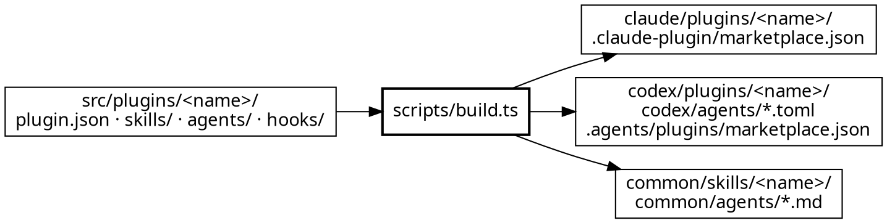

中文版: [README.zh-CN.mdx](./README.zh-CN.mdx)

> The agreement between everything written under `src/` and everything that reads the compiled trees:
> the compiler, both marketplace manifests, npm, and five of the six gates.
> **Authoritative source: [`../../../scripts/build.ts`](../../../scripts/build.ts) and
> [`../../../src/common.ts`](../../../src/common.ts).**
> The one-line summary of the eight per-end mechanisms is in [`../../../README.md`](../../../README.md);
> the three description slots are owned by [`../../../AGENTS.md`](../../../AGENTS.md). This document is
> the mechanics — what lands where, what is refused, and what is guaranteed.

## 1. The shape of the deal

`src/` is the only source. `claude/`, `codex/`, `common/`, `.claude-plugin/marketplace.json` and
`.agents/plugins/marketplace.json` are artifacts **in their entirety** — 379 files at the time of
writing, which `make build` reports back on every run. Not one of them is hand-written.

The three ends are fixed in `ENDS` and every per-end table is keyed by them, so adding a fourth end is
a change to one array plus the tables that index it — not a change scattered through the compiler.

## 2. Where each source file lands

`
` is the plugin directory name, which `plugin.json`'s `name` must match. A dash means the end has
no place for that concept.

| Source under `src/plugins/
/` | claude | codex | common |
|---|---|---|---|
| `plugin.json` | `.claude-plugin/plugin.json` | `.codex-plugin/plugin.json` | — no manifest concept |
| `plugin.json` → `npm` block | `package.json` | — | — |
| `plugin.json` → `dependencies` | `.claude-plugin/plugin.json` | — **unverified, not a decision** | — |
| the repository's `LICENSE` | `LICENSE` | `LICENSE` | — |
| `README.md`, `.mcp.json` | copied to the plugin root | copied to the plugin root | — the tree is flat, nowhere to put it |
| `skills/**` | `skills/<rel>` | `skills/<rel>` | `common/skills/<rel>` |
| a `SKILL.md` with `command: true` | `commands/<skill>.md` as well | — no commands concept | — no agreed location |
| `agents/<name>.md` | `agents/<id>.md` | `codex/agents/<id>.toml`, **outside the plugin** | `common/agents/<id>.md` |
| `agents/README.md` | — | `codex/agents/README.md` | — |
| `hooks/**` | `hooks/<rel>` | — a `hooks` field makes Codex's validator exit 1 | — no hook concept |

Everything for claude and codex sits under `<end>/plugins/
/`. **Common drops the plugin directory
entirely**, which is the single most consequential asymmetry in the table: a skill name is
repository-global there, so two plugins can never both ship a `debug` skill.

`codex/agents/` sits at the repository root because a Codex plugin **cannot bundle agents** — the user
copies the `.toml` files into `~/.codex/agents/` by hand, which is what `codex/agents/README.md`
explains.

## 3. What does not compile

Four kinds of source file reach no artifact at all, and each absence is deliberate:

| Not emitted | Rule | Why |
|---|---|---|
| `evals/**`, `*.test.ts` | `NO_SHIP` in `build.ts` | trigger fixtures exist to tune a description **in this repository**; an installed plugin has no use for them |
| anything at a plugin root except `README.md` and `.mcp.json` | an explicit two-entry allowlist | a plugin root is not a dumping ground. `src/plugins/genai-dev-flow/AGENTS.md` relies on this: it is guidance for whoever edits the plugin, and it must not ship |
| a skill's frontmatter beyond `name` and `description` | the emitted head is rebuilt, not copied | `command: true` is **consumed** by the compiler, not passed on; the host never sees it |
| backticks in a Codex agent description | stripped in `build.ts` | they survive fine in markdown; in the TOML value they are noise |

An emitted agent's frontmatter is likewise rebuilt per end, not copied: claude gets
`name` / `description` / `model` plus `effort`, `color`, `memory`, `tools` when present; codex gets
`name` / `description` / `model` / `model_reasoning_effort` and the body as
`developer_instructions = """…"""`; common gets `name` / `description` and `tools` only, with **no model
field at all** — the host knows which providers are configured and a wrong model id fails at run time,
while an absent one lets the host decide.

## 4. What is rendered, and what is copied byte for byte

Only `.md` and `.mdx` go through rendering — variant resolution then `${PLUGIN_ROOT}` substitution.
Scripts, data and assets are copied verbatim, **with their permission bits preserved**: a bundled
`probe.sh` that arrives non-executable is a skill that cannot run its own script, and nothing else in
the pipeline would notice.

`.mcp.json` is the one exception on the data side. It is data, but it carries a server command path, so
it goes through the same substitution as prose — otherwise the Codex artifact would point at Claude's
plugin root.

One subtlety in rendering, in `collapseBlankRuns`: an end that drops two adjacent variant blocks is
left with a four-newline hole, so runs of three or more newlines collapse to two — **except inside a
fenced code block**, where blank lines are content. Fences are cut out and rejoined untouched.

## 5. Five refusals, and where they fire

The compiler exits 2 rather than emitting something wrong. Two of these can only be seen at compile
time, which is why they are not gates:

| Refusal | Trigger |
|---|---|
| `plugin.json declares name "x" — it must match its directory` | the manifest and its directory disagree |
| `two sources both compile to <path>` | two sources claim one artifact path — in practice, one skill name used by two plugins, which only collides on the common end |
| `a variant marker survives the <end> render` | a typo'd end name or a missing `<!--@end-->`; the marker leaking into the output is the signature |
| `npm.files does not name <dirs>` | the compile emits a directory under `claude/plugins/
/` that the published `files` list does not mention |
| `tier "x" is not one of top \| standard \| light` | an agent's tier is not in the `TIER` table |

The `npm.files` check is the one worth understanding, because the failure it prevents is silent: npm
ships exactly what `files` names and drops the rest without a warning, so a plugin that grows a
directory publishes installable, importable, and missing the part that was just added. It is checked
against the compile's own record of what it emitted, so it cannot drift from what actually ships.

## 6. Artifact roots, orphans, and one scoping lesson

`OUT_ROOTS` is the five directories the compiler owns: `claude`, `codex`, `common`,
`.claude-plugin`, and **`.agents/plugins` — not `.agents`**. Anything inside an owned root that the
source does not produce is an orphan, and the two modes treat orphans differently on purpose:

- `make build` **sweeps** them, then names each one. The trees are 100% generated, so an orphan is by
  definition residue from an earlier compile — a file since deleted from the source.
- `make verify-build` **fails** on them. Without that, "the trees are artifacts in their entirety" is
  simply untrue.

The narrow scoping of `.agents/plugins` is a fixed bug worth not re-introducing: the compiler emits
exactly one file there, but `.agents/` is a shared vendor-neutral convention that other tools install
into — OpenSpec really does write `.agents/skills/`. Owning the parent made every `make build` silently
delete those as orphans; recoverable, but recurring once per build and buried where nobody reads it.

## 7. The four modes

| Command | Mode | Exit codes |
|---|---|---|
| `make build` | compile: write what differs, sweep orphans | 0 · 2 on a source error |
| `make verify-build` | `--check`: compare only, **no side effects at all** | 0 in sync · 1 on drift or orphans · 2 on a source error |
| `make clean` | `--clean`: delete every artifact, prune empty directories | 0 |
| `make rebuild` | `--verify-roundtrip`: snapshot → delete → rebuild → byte-compare | 0 · 1 on any discrepancy |

Side-effect freedom in `--check` is structural rather than promised: every artifact is built into one
in-memory map first, and writing or comparing happens in a single pass at the end.

`--check` also catches **permission-bit drift on its own** — same bytes, no longer executable.

## 8. Two guarantees

**The source is complete.** `make rebuild` deletes every artifact and regenerates it, then compares
byte for byte, reporting three distinguishable failures: a file not recreated after the clean (an
orphan), a file whose content changed, and a file that appeared out of nowhere. It needs no git state,
so it holds in a dirty worktree.

**The ends cannot drift apart.** A capability has exactly one source, and the price is paid openly: a
double diff on every change. That is why the artifacts are committed at all — the Claude marketplace
installs straight from the repository, so what a user clones must already contain a finished
`claude/plugins/<name>/`.

---
> Enforcement of everything above lives in [`../toolchain/`](../toolchain/). The `genai-dev-flow`
> artifacts have a second contract on the far side of installation: [`../flow-contract/`](../flow-contract/).
