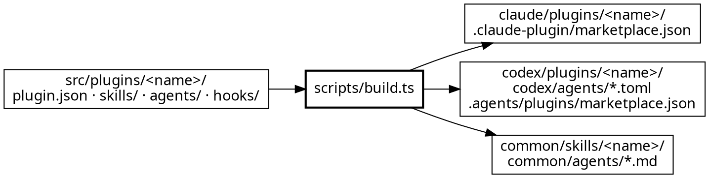

English: [README.mdx](./README.mdx)

> 所有写在 `src/` 里的东西，与所有读编译产物的东西之间的约定：编译器、两份 marketplace 清单、npm，以及六道门里
> 的五道。
> **权威来源：[`../../../scripts/build.ts`](../../../scripts/build.ts) 与
> [`../../../src/common.ts`](../../../src/common.ts)。**
> 八种单端机制的一行版在 [`../../../README.zh-CN.md`](../../../README.zh-CN.md)；description 三槽位归
> [`../../../AGENTS.md`](../../../AGENTS.md) 管。本文写的是机制 —— 什么落到哪里、什么会被拒绝、保证了什么。

## 1. 这笔交易的形状

`src/` 是唯一源码。`claude/`、`codex/`、`common/`、`.claude-plugin/marketplace.json` 和
`.agents/plugins/marketplace.json` **整体都是产物** —— 写这份文档时是 379 个文件，每次 `make build` 都会把这个
数报回来。其中没有一个是手写的。

三个端定在 `ENDS` 里，所有按端分的表都以它为键。所以加第四个端 = 改一个数组，加上以它为索引的那几张表 —— 而
不是在编译器里到处改。

## 2. 每类源文件落到哪里

`
` 是插件目录名，`plugin.json` 的 `name` 必须与它一致。横线表示该端没有这个概念。

| `src/plugins/
/` 下的源文件 | claude | codex | common |
|---|---|---|---|
| `plugin.json` | `.claude-plugin/plugin.json` | `.codex-plugin/plugin.json` | — 没有 manifest 概念 |
| `plugin.json` 的 `npm` 块 | `package.json` | — | — |
| 仓库根的 `LICENSE` | `LICENSE` | `LICENSE` | — |
| `README.md`、`.mcp.json` | 拷到插件根 | 拷到插件根 | — 树是扁的，没地方放 |
| `skills/**` | `skills/<rel>` | `skills/<rel>` | `common/skills/<rel>` |
| 带 `command: true` 的 `SKILL.md` | 额外产出 `commands/<skill>.md` | — 没有 command 概念 | — 没有公认位置 |
| `agents/<name>.md` | `agents/<id>.md` | `codex/agents/<id>.toml`，**在插件之外** | `common/agents/<id>.md` |
| `agents/README.md` | — | `codex/agents/README.md` | — |
| `hooks/**` | `hooks/<rel>` | — 带 `hooks` 字段会让 Codex 的校验器 exit 1 | — 没有 hook 概念 |

claude 和 codex 的一切都在 `<end>/plugins/
/` 下。**common 端把插件目录整个丢掉了** —— 这是全表里后果最大的
一处不对称：skill 名在那里是**仓库全局**的，所以两个插件永远不可能都发一个叫 `debug` 的 skill。

`codex/agents/` 落在仓库根，是因为 Codex 插件**不能捆绑 agent** —— 用户得手工把 `.toml` 拷进
`~/.codex/agents/`，这也正是 `codex/agents/README.md` 在解释的事。

## 3. 什么不参与编译

有四类源文件根本不产出任何产物，每一类的缺席都是刻意的：

| 不输出 | 规则 | 为什么 |
|---|---|---|
| `evals/**`、`*.test.ts` | `build.ts` 里的 `NO_SHIP` | 触发 fixture 的存在意义是**在本仓库里**调 description；装了插件的用户用不上 |
| 插件根除 `README.md` 和 `.mcp.json` 之外的任何文件 | 一条只有两项的显式白名单 | 插件根不是垃圾桶。`src/plugins/genai-dev-flow/AGENTS.md` 正是靠这条：它是给改这个插件的人看的，绝不能发出去 |
| skill frontmatter 里除 `name` 和 `description` 之外的字段 | 输出的头部是**重建**的，不是拷贝 | `command: true` 被编译器**消费**掉，不会传下去；host 从来看不到它 |
| Codex agent description 里的反引号 | 在 `build.ts` 里被剥掉 | 它在 markdown 里没问题；在 TOML 值里就是噪音 |

agent 的 frontmatter 同样是按端重建而非拷贝：claude 拿 `name` / `description` / `model`，外加存在时的
`effort`、`color`、`memory`、`tools`；codex 拿 `name` / `description` / `model` /
`model_reasoning_effort`，正文放进 `developer_instructions = """…"""`；common 只拿 `name` / `description`
和 `tools`，**完全没有 model 字段** —— host 才知道配了哪些供应商，写错的 model id 会在运行时炸，而没有这个字段
则是把选择权交回 host。

## 4. 什么被渲染，什么逐字节拷贝

只有 `.md` 和 `.mdx` 走渲染 —— 先解析 variant，再替换 `${PLUGIN_ROOT}`。脚本、数据、资源逐字节拷贝，**并且保留
权限位**：捆绑的 `probe.sh` 如果到了用户那边没有可执行位，那就是一个跑不了自己脚本的 skill，而流程里没有别的
环节会发现。

数据这一侧有一个例外：`.mcp.json`。它是数据，但里面带着 server 命令路径，所以它和正文走同一套替换 —— 否则
Codex 的产物会指向 Claude 的插件根。

渲染里还有一处细节，在 `collapseBlankRuns`：某个端丢掉两个相邻的 variant 块之后，会留下一个四连换行的洞，所以
三个及以上的连续换行会被压成两个 —— **除了在围栏代码块里面**，那里的空行是内容。围栏会被切出来，原样接回去。

## 5. 五种拒绝，各自的触发点

编译器宁可 exit 2 也不输出错的东西。其中两条只能在编译期看见，这也是它们不是「门」的原因：

| 拒绝 | 触发条件 |
|---|---|
| `plugin.json declares name "x" — it must match its directory` | manifest 与它所在目录不一致 |
| `two sources both compile to <path>` | 两个源码抢同一个产物路径 —— 实际场景是两个插件用了同一个 skill 名，而且只在 common 端撞上 |
| `a variant marker survives the <end> render` | 端名拼错，或漏了 `<!--@end-->`；marker 漏进输出就是它的 signature |
| `npm.files does not name <dirs>` | 编译在 `claude/plugins/
/` 下产出了某个目录，而发布用的 `files` 清单没提它 |
| `tier "x" is not one of top \| standard \| light` | agent 的 tier 不在 `TIER` 表里 |

`npm.files` 那条最值得理解，因为它拦的失败是无声的：npm 只发 `files` 点到的东西，其余直接丢弃且不给警告 ——
于是一个长出新目录的插件会发布成「装得上、能 import、但刚加的那部分不在里面」。它是拿编译器**自己那份产出记录**
去校验的，所以不可能与真正发出去的内容脱节。

## 6. 产物根、孤儿，以及一次关于「拥有范围」的教训

`OUT_ROOTS` 是编译器拥有的五个目录：`claude`、`codex`、`common`、`.claude-plugin`，以及
**`.agents/plugins` —— 不是 `.agents`**。被拥有的根里凡是源码不产出的东西都是孤儿，而两种模式对孤儿的处理刻意
不同：

- `make build` 会**扫掉**它们，然后逐个报出来。产物树 100% 生成，所以孤儿按定义就是上一次编译的残渣 —— 一个后来
  从源码里删掉的文件。
- `make verify-build` 会**因它失败**。没有这条，「产物树整体都是产物」这句话根本不成立。

`.agents/plugins` 这个窄范围是一个修好了、值得别再犯的 bug：编译器在那儿只产出一个文件，但 `.agents/` 是厂商
中立的公共约定，别的工具会往里装东西 —— OpenSpec 真的会写 `.agents/skills/`。当初拥有了父目录，结果每次
`make build` 都会把那些当孤儿静默删掉；可恢复（写它的工具能再写一遍），但每次构建都发生一遍，而且埋在没人看的
输出中段。

## 7. 四种模式

| 命令 | 模式 | 退出码 |
|---|---|---|
| `make build` | 编译：只写有差异的，扫掉孤儿 | 0 · 源码有错则 2 |
| `make verify-build` | `--check`：只比对，**完全没有副作用** | 一致 0 · 有漂移或孤儿 1 · 源码有错 2 |
| `make clean` | `--clean`：删掉每个产物，剪掉空目录 | 0 |
| `make rebuild` | `--verify-roundtrip`：快照 → 删除 → 重建 → 逐字节比对 | 0 · 有任何差异则 1 |

`--check` 的无副作用是**结构性的**，不是承诺出来的：每个产物先建进一张内存 map，写入或比对在最后一次遍历里
统一发生。

`--check` 还能**单独抓到权限位漂移** —— 字节没变，但不再可执行。

## 8. 两项保证

**源码是完整的。** `make rebuild` 删掉每个产物再重新生成，然后逐字节比对，并把三种失败区分开报出来：clean 之后
没被重建出来的（孤儿）、内容变了的、凭空出现的。它不需要任何 git 状态，所以在脏工作区里同样成立。

**三端不会各自漂移。** 一个能力只有一份源码，代价也摆在明面上：每次改动都是双份 diff。这也正是产物要提交进仓库
的原因 —— Claude marketplace 直接从仓库安装，用户克隆下来时就必须已经有一个完整的 `claude/plugins/<name>/`。

---
> 上面这些的**执行**在 [`../toolchain/`](../toolchain/README.zh-CN.mdx)。`genai-dev-flow` 的产物在安装之后还有
> 第二份契约：[`../flow-contract/`](../flow-contract/README.zh-CN.mdx)。
