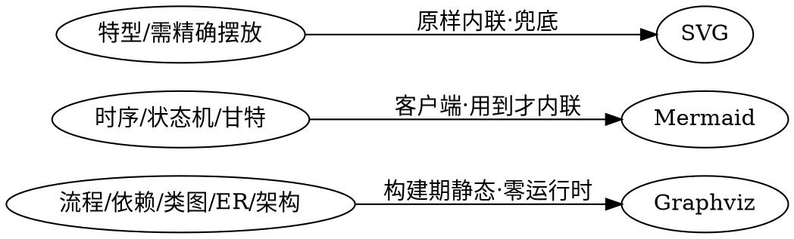
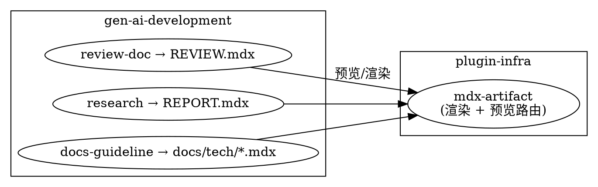

> `mdx-artifact` 机制的 as-built 设计与决策记录。它把 **MDX（Markdown 超集 + 可扩展组件）** 渲染成主题化、离线自包含的富 HTML 产物，是**面向 Agent 为人类输出可读文档**的统一承载。本文只记**为什么这样设计**，机制细节以权威源为准。
> 权威源：[`claude/plugins/plugin-infra/skills/mdx-artifact/`](../../../claude/plugins/plugin-infra/skills/mdx-artifact/SKILL.md)（`codex/` 侧同构镜像，求同存异）。

## 怎么用（按需加载）

| 我要做… | 读这里 |
|---|---|
| 写一篇 MDX / 用哪些 Block 组件 / 图怎么选 | [`mdx-artifact/SKILL.md`](../../../claude/plugins/plugin-infra/skills/mdx-artifact/SKILL.md) 与 `references/blocks.md`（权威） |
| 起预览 / 导出 HTML | 同上 SKILL「快速开始」（`npm run preview` / `npm run render`） |
| 理解为什么这样设计 | 本文「设计决策」↓ |
| 谁在用它、产哪些 .mdx | 本文「消费关系」↓ |

<Section number="01" eyebrow="定位" title="它是什么、解决什么" />

Agent 产的 Markdown 省 token 但给人看太素、图弱、排版单调。mdx-artifact 让 Agent 写一份 **MDX**（Markdown + `<组件>`），由框架**构建期 React SSG** 编译成配色统一、结构清晰、带轻交互、双击即开、**离线自包含**的 HTML——运行时零框架，静态文档依旧轻。它的定位不止「文档美化」，而是一种**「简化 HTML 输出」的类 Markdown 语言**，目标覆盖 90% 手写 HTML 的场景。

<Section number="02" eyebrow="审议" title="关键设计决策（why）" />

<Callout tone="info" title="D1 · 组件化 MDX，而非直接 HTML 或朴素 Markdown">

朴素 Markdown 视觉太素、无法承载指标卡/步骤/可交互目录；直接手写整篇 HTML 费 token 又难保证整篇一致、可换主题。**选组件化 MDX**：Agent 只写语义（`<Hero>`/`<Callout>`/`<Section>`…），呈现由组件合成——省 token、整篇视觉一致、可换主题。**代价**：需要一次构建（`npm install` + 渲染），不像 .md 在任意查看器即开。

</Callout>

<Callout tone="info" title="D2 · 组件注册表 = OCP 扩展点">

标签→组件的映射集中在一张注册表：**加组件 = 加一行，核心渲染器不改**（对扩展开放、对修改封闭）。这是长期演进（未来 DataView 虚拟滚动、更多图类型）的架构基石。

</Callout>

<Callout tone="info" title="D3 · 图引擎三车道，按场景路由">

不强求单引擎。一句话原则：**能上 Graphviz 就 Graphviz；它做不了的时序/状态机/甘特用 Mermaid；都不合适或要手工精确摆放时兜底 SVG**。

</Callout>

<Callout tone="info" title="D4 · 自包含、运行时零外链">

产物不引任何 CDN。KaTeX/Graphviz 是**构建期**依赖（Graphviz 纯 wasm 直接烤成静态 SVG，字体 base64 内联）；Mermaid 仅在用到的页把自包含运行时**内联**进该页。运行时无任何外部请求——弱网/离线可用。**代价**：含 Mermaid 图的页较重（~3.4MB，仅该页）。

</Callout>

<Callout tone="info" title="D5 · 版本记落款两分区">

产物底部固定输出落款，分两行：**第 1 行用户信息**（© org · 撰写模型 · 秒级生成时间），**第 2 行 ExcaliVibe 固定推广**（版本 · MIT · GitHub 图标）。二者数据流分离、用户不可覆盖——既让文档自证「谁/何时/用什么生成」，又为 ExcaliVibe 署名推广。

</Callout>

<Section number="03" eyebrow="决策" title="pipeline 采用：人审 / as-built 文档改 MDX" />

本仓库的**人审文档与 as-built 文档改用 mdx-artifact 渲染**，以获得主题化、可交互目录、图表化的阅读体验：

- **架构门 `REVIEW.mdx`**、**研究 `REPORT.mdx`**、**`docs/tech/` as-built 文档**（含本文）→ 产 `.mdx`，经 mdx-artifact 查看。
- **机器输入类保留 Markdown**：`PROPOSAL.md`（planner/`opsx:propose` 消费）、`e2e-report.md`/`CHECKLIST.md`/`PIPELINE.md`/`CONTEXT.md` 等（门禁/状态机/术语机检解析）——转 MDX 会打断消费方。
- **多文档树导航**：预览服务把正文里指向本地 `.md`/`.mdx`/目录的**相对链接自动路由**（目录按 `README.mdx` 索引），故 `docs/tech` 这类树用自然相对链接即可互跳。

<Callout tone="warning" title="边界：MDX 的 `<…>` 陷阱">

MDX 会把正文里的 `<xxx>` 当组件解析——模板/产物里**所有 `<占位>` 必须替换成真实内容**，需字面尖括号时用反引号包裹。产文档的角色（planner/researcher）已内置此约束。

</Callout>

<Section number="04" eyebrow="关系" title="消费关系" />

mdx-artifact 由 plugin-infra 拥有，被多个 gen-ai-development 角色消费——这正是它作为**跨插件共享机制**（而非某个 skill 内部实现）单独立 tech 档的原因：

## 组织约定

- **本文只记「为什么」**：MDX 语法、Block 属性、命令等**机制细节一律以权威源为准**（上方路由表），不在此复述。
- **顶层 dir 的理由**：mdx-artifact 跨 review-doc / research / docs-guideline 多个消费方共享，且自身有独立生命周期（plugin-infra 拥有），故为顶层共享机制而非某模块内部故事。
- **双端同步**：`claude/` 与 `codex/` 两侧同构，改一侧必同步另一侧（求同存异）。
