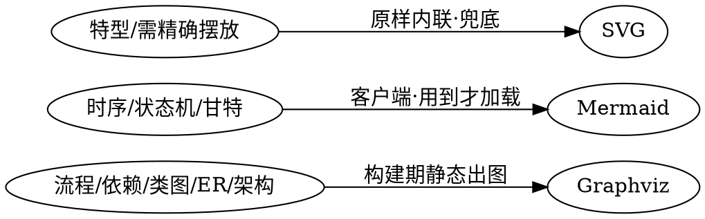
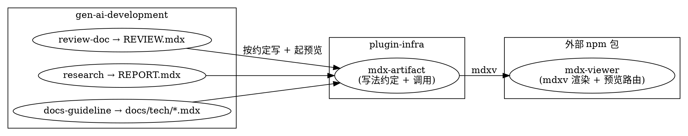

> `mdx-artifact` 机制的 as-built 设计与决策记录。它让 Agent 写 **MDX（Markdown 超集 + 可扩展组件）**，再交给独立的渲染器起本地预览，是**面向 Agent 为人类输出可读文档**的统一承载。本文只记**为什么这样设计**，机制细节以权威源为准。
> 权威源：[`claude/plugins/plugin-infra/skills/mdx-artifact/`](../../../claude/plugins/plugin-infra/skills/mdx-artifact/SKILL.md)（`codex/` 侧同构镜像，求同存异）；渲染器是外部包 [yanxuan-lc/mdx-viewer](https://github.com/yanxuan-lc/mdx-viewer)。

## 怎么用（按需加载）

| 我要做… | 读这里 |
|---|---|
| 写一篇 MDX / 用哪些 Block 组件 / 图怎么选 | [`mdx-artifact/SKILL.md`](../../../claude/plugins/plugin-infra/skills/mdx-artifact/SKILL.md) 与 `references/blocks.md`（权威） |
| 起预览给人看 | 同上 SKILL「工具就绪与预览」（`npm install -g mdx-viewer` → `mdxv <文件\|目录>`） |
| 理解为什么这样设计 | 本文「设计决策」↓ |
| 谁在用它、产哪些 .mdx | 本文「消费关系」↓ |

<Section number="01" eyebrow="定位" title="它是什么、解决什么" />

Agent 产的 Markdown 省 token 但给人看太素、图弱、排版单调。mdx-artifact 让 Agent 写一份 **MDX**（Markdown + `<组件>`），由渲染器编译成配色统一、结构清晰、带轻交互的网页。它的定位不止「文档美化」，而是一种**「简化 HTML 输出」的类 Markdown 语言**，目标覆盖 90% 手写 HTML 的场景。

**边界**：skill 交付的是 `.mdx`，查看方式是本地预览（`mdxv`）。渲染实现、组件源码、导出等能力都在外部包里，不属于本仓库。

<Section number="02" eyebrow="审议" title="关键设计决策（why）" />

<Callout tone="info" title="D1 · 组件化 MDX，而非直接 HTML 或朴素 Markdown">

朴素 Markdown 视觉太素、无法承载指标卡/步骤/可交互目录；直接手写整篇 HTML 费 token 又难保证整篇一致、可换主题。**选组件化 MDX**：Agent 只写语义（`<Hero>`/`<Callout>`/`<Section>`…），呈现由组件合成——省 token、整篇视觉一致、可换主题。**代价**：需要一个渲染器才能看，不像 `.md` 在任意查看器即开。

</Callout>

<Callout tone="success" title="D2 · 渲染器外置成独立 npm 包（本次变更）">

原先渲染器（React SSG + 组件注册表）**内置在 skill 目录**里，靠 `npm install` + `npm run preview/render` 驱动。现改为依赖全局包 **mdx-viewer**（`mdxv` 预览）。理由：

- **单一事实源**：渲染器有自己的生命周期（编译管线、组件库、测试、版本）。它留在 skill 里，就等于每次改组件都要在两个 Agent 侧各镜像一份实现，而这部分**没有任何「求同存异」的必要**——它不是 Agent 能力，是通用工具。
- **skill 回到它该做的事**：什么时候产富文档（触发）、怎么写（骨架 + Block API）、怎么给人看（`mdxv`）。skill 目录从「实现 + 规范」瘦成两份 Markdown。
- **官方兼容性由上游保证**：mdx-viewer 的底座是官方 `@mdx-js/rollup`（MDX v3），GFM / frontmatter / 数学 / Shiki 高亮按官方推荐接入，比自维护一套编译管线更稳。
- **代价**：多一个外部前置依赖（`npm install -g mdx-viewer`，或 `npx -p mdx-viewer` 免装兜底），且组件/参数的权威源移到包里——skill 的速查表要标注对齐版本，避免漂移。

</Callout>

<Callout tone="info" title="D3 · 图引擎三车道，按场景路由">

不强求单引擎。一句话原则：**能上 Graphviz 就 Graphviz；它做不了的时序/状态机/甘特用 Mermaid；都不合适或要手工精确摆放时兜底 SVG**。

</Callout>

```dot
digraph { rankdir=LR
  结构关系图 [label="流程/依赖/类图/ER/架构"]
  专用记法 [label="时序/状态机/甘特"]
  自定义 [label="特型/需精确摆放"]
  结构关系图 -> Graphviz [label="构建期静态出图"]
  专用记法 -> Mermaid [label="客户端·用到才加载"]
  自定义 -> SVG [label="原样内联·兜底"]
}
```

<Callout tone="warning" title="D4 · 落款：datetime 由作者填，没有自动兜底">

产物底部的落款让文档自证「谁、何时写的」：`由 {author} 编辑于 {datetime}` + `© {年} {copyright}`，下方固定一行渲染器署名（不可配置）。**渲染器只读 frontmatter，不会捕获时间**——所以产文档的角色必须自己取当前时刻写进 `datetime`（`yyyy-MM-dd HH:mm:ss`）。这是外置渲染器后最容易踩的坑：漏填不会报错，只是静默少一行时间戳。

</Callout>

<Section number="03" eyebrow="决策" title="pipeline 采用：人审 / as-built 文档用 MDX" />

本仓库的**人审文档与 as-built 文档都写成 MDX**，以获得主题化、分节清晰、图表化的阅读体验：

- **架构门 `REVIEW.mdx`**、**研究 `REPORT.mdx`**、**`docs/tech/` as-built 文档**（含本文）→ 产 `.mdx`，用 `mdxv` 预览查看。
- **机器输入类保留 Markdown**：`PROPOSAL.md`（planner/`opsx:propose` 消费）、`e2e-report.md`/`CHECKLIST.md`/`PIPELINE.md`/`CONTEXT.md` 等（门禁/状态机/术语机检解析）——转 MDX 会打断消费方。
- **多文档树导航**：以目录为根起预览时，正文里指向本地 `.md`/`.mdx`/目录的**相对链接自动路由**（目录按 `README.mdx` 索引），故 `docs/tech` 这类树用自然相对链接即可互跳。

<Callout tone="warning" title="边界：MDX 的 `<…>` 陷阱">

MDX 会把正文里的 `<xxx>` 当组件解析——模板/产物里**所有 `<占位>` 必须替换成真实内容**，需字面尖括号时用反引号包裹。产文档的角色（planner/researcher）已内置此约束。

</Callout>

<Section number="04" eyebrow="关系" title="消费关系" />

mdx-artifact 由 plugin-infra 拥有，被多个 gen-ai-development 角色消费——这正是它作为**跨插件共享机制**（而非某个 skill 内部实现）单独立 tech 档的原因：

```dot
digraph { rankdir=LR
  subgraph cluster_ext { label="外部 npm 包"; MV [label="mdx-viewer\n(mdxv 渲染 + 预览路由)"] }
  subgraph cluster_infra { label="plugin-infra"; MA [label="mdx-artifact\n(写法约定 + 调用)"] }
  subgraph cluster_dev { label="gen-ai-development"
    RD [label="review-doc → REVIEW.mdx"]
    RP [label="research → REPORT.mdx"]
    DG [label="docs-guideline → docs/tech/*.mdx"]
  }
  RD -> MA [label="按约定写 + 起预览"]
  RP -> MA
  DG -> MA
  MA -> MV [label="mdxv"]
}
```

## 组织约定

- **本文只记「为什么」**：MDX 语法、Block 属性、命令等**机制细节一律以权威源为准**（上方路由表），不在此复述。
- **顶层 dir 的理由**：mdx-artifact 跨 review-doc / research / docs-guideline 多个消费方共享，且自身有独立生命周期（plugin-infra 拥有），故为顶层共享机制而非某模块内部故事。
- **双端同步**：`claude/` 与 `codex/` 两侧同构，改一侧必同步另一侧（求同存异）；渲染器一侧共用同一个外部包，无需镜像。
